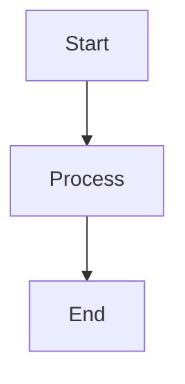

# Hextra Theme Migration Guide

This document describes the migration from MkDocs Material theme to Hugo with Hextra theme.

## Overview

Hextra is a modern, fast documentation theme for Hugo that provides features similar to MkDocs Material:

- ✅ Built-in FlexSearch for instant full-text search
- ✅ Dark/Light mode support (system preference detection)
- ✅ Mermaid diagrams support
- ✅ LaTeX/KaTeX math rendering
- ✅ Responsive sidebar navigation
- ✅ Callouts (admonitions equivalent)
- ✅ Tabs, Steps, and other Markdown extras
- ✅ Clean, modern design

## Configuration Changes

### 1. Theme Installation

Hextra is installed as a Hugo module. Run these commands to initialize:

```bash
cd /home/weigl/work/key-docs
hugo mod init github.com/KeYProject/key-docs
hugo mod get github.com/imfing/hextra
hugo mod npm pack  # If using Tailwind CSS customization
```

### 2. hugo.toml Updates

The `hugo.toml` has been updated with:

- Theme changed from `docsy` to `hextra`
- Module imports pointing to `github.com/imfing/hextra`
- Hextra-specific parameters (FlexSearch, KaTeX, Mermaid)
- Updated menu configuration for Hextra's navbar structure

### 3. Navigation Structure

**Hextra uses a different navigation approach:**

- **Top Navbar**: Defined in `hugo.toml` under `[[menu.main]]`
- **Sidebar Navigation**: Defined in section `_index.md` files using the `sidebar` frontmatter

Example sidebar configuration in `content/user/_index.md`:

```yaml
---
title: "User Guide"
weight: 1
sidebar:
  - title: "Getting Started"
    pages:
      - _index.md
      - installation.md
      - quickstart.md
  - title: "Features"
    pages:
      - specifications.md
      - proofs.md
---
```

Or use Hextra's automatic sidebar generation by organizing content in folders.

## Feature Mapping

| MkDocs Material | Hextra Equivalent | Notes |
|-----------------|-------------------|-------|
| `search` plugin | FlexSearch (built-in) | Automatic, no config needed |
| `mermaid2` plugin | `[params.mermaid]` | Enabled in hugo.toml |
| `pymdownx.arithmatex` | `[params.katex]` | Uses KaTeX instead of MathJax |
| `admonitions` | `` shortcode | Similar syntax |
| `tabs` plugin | `` shortcode | Built-in |
| `footnotes` | Goldmark footnotes | Native Markdown support |
| `attr_list` | Goldmark attributes | Native support |
| `toc` | `[markup.tableOfContents]` | Configured in hugo.toml |
| `pymdownx.highlight` | `[markup.highlight]` | Hugo's built-in highlighter |

## Hextra Shortcodes

### Callouts (Admonitions)

```markdown

This is an info callout (like MkDocs admonition).



This is a warning.



This is an error message.

```

Available types: `info`, `warning`, `error`, `success`

### Tabs

```markdown



```java
public class Example { }
```



```python
class Example: pass
```



```

### Steps

```markdown



### Step 1: Install
Installation instructions here.



### Step 2: Configure
Configuration instructions here.



```

### Cards

```markdown

  
  

```

## Math Support (KaTeX)

Hextra uses KaTeX for math rendering. Use standard delimiters:

- Inline: `$...$` or `\(...\)`
- Display: `$$...$$` or `\[...\]`

Example:
```markdown
Inline: $E = mc^2$

Display:
$$
\sum_{i=1}^{n} i = \frac{n(n+1)}{2}
$$
```

## Mermaid Diagrams

Mermaid is enabled by default. Use code blocks with `mermaid` language:

````markdown

````

## Custom CSS/JS

Add custom files in `assets/css/` and `assets/js/`, then reference in `hugo.toml`:

```toml
[params]
  customCSS = ["css/custom.css"]
  customJS = ["js/custom.js"]
```

## Building the Site

```bash
# Development server
hugo server -D

# Production build
hugo --minify --gc
```

## Deployment

For GitHub Pages, update your deployment workflow:

```yaml
# .github/workflows/deploy.yml
- name: Setup Hugo
  uses: peaceiris/actions-hugo@v2
  with:
    hugo-version: '0.120.0'
    extended: true

- name: Build
  run: hugo --minify --gc

- name: Deploy
  uses: peaceiris/actions-gh-pages@v3
  with:
    github_token: ${{ secrets.GITHUB_TOKEN }}
    publish_dir: ./public
```

## Troubleshooting

### Module Issues

If you encounter module errors:

```bash
hugo mod clean --all
hugo mod get -u
hugo mod tidy
```

### Search Not Working

Ensure `outputs.home` includes `JSON` and the theme is properly loaded:

```bash
hugo mod get -u github.com/imfing/hextra
```

### Dark Mode Issues

Check browser system preferences. You can force a default in `hugo.toml`:

```toml
[params]
  defaultTheme = "light"  # or "dark" or "system"
```

## Next Steps

1. Initialize Hugo modules: `hugo mod init` and `hugo mod get`
2. Create section `_index.md` files with sidebar configuration
3. Test the site locally: `hugo server -D`
4. Update any custom shortcodes to Hextra equivalents
5. Deploy and verify all features work correctly
