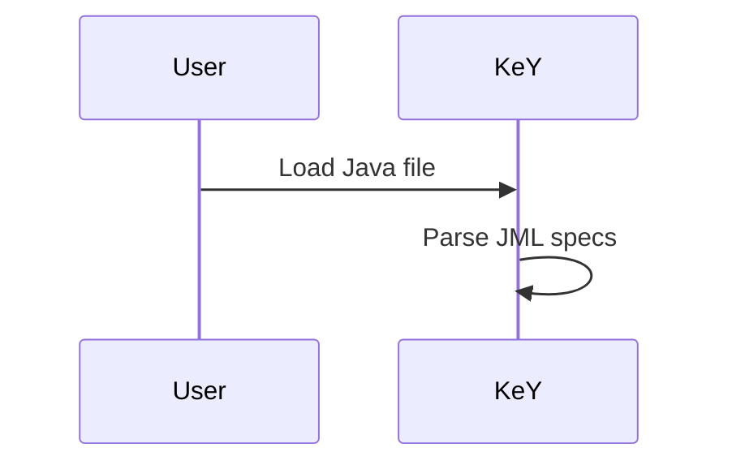

# Hextra Theme Setup Instructions

This file provides step-by-step instructions to complete the Hextra theme setup.

## Quick Start

Run these commands in order:

```bash
cd /home/weigl/work/key-docs

# 1. Initialize Hugo modules (if not already done)
hugo mod init github.com/KeYProject/key-docs

# 2. Get the Hextra theme
hugo mod get github.com/imfing/hextra

# 3. Download all dependencies
hugo mod get -u

# 4. Clean module cache if needed
hugo mod clean --all

# 5. Test the site
hugo server -D
```

## Files Created/Updated

### 1. hugo.toml (Updated)

The main configuration has been updated with:
- Theme: `hextra` (changed from `docsy`)
- Module import: `github.com/imfing/hextra`
- FlexSearch configuration for instant search
- KaTeX for math rendering
- Mermaid for diagrams
- Dark mode support (system default)

### 2. Required Directory Structure

Create these directories if they don't exist:

```
content/
├── _index.md           # Homepage
├── user/
│   └── _index.md       # User Guide section
├── devel/
│   └── _index.md       # Developer Guide section
├── keps/
│   └── _index.md       # KEPs section
└── eclipse/
    └── _index.md       # Historical section

assets/
├── css/
│   └── custom.css      # Optional custom styles
└── js/
    └── custom.js       # Optional custom scripts

archetypes/
├── default.md          # Default page template
└── docs.md             # Documentation page template
```

### 3. Section Index Files

Each section needs an `_index.md` file. Example for `content/user/_index.md`:

```yaml
---
title: "User Guide"
description: "Guide for KeY users"
weight: 1
cascade:
  type: docs
---

# User Guide

Welcome to the KeY User Guide.


  
  
  

```

## Hextra Shortcodes Reference

### Callouts (Admonitions)

```markdown

Info message (blue)



Warning message (yellow)



Error message (red)



Success message (green)

```

### Tabs

```markdown



```java
System.out.println("Hello");
```



```python
print("Hello")
```



```

### Steps

```markdown



### Step 1
First step content.



### Step 2
Second step content.



```

### Cards

```markdown

  

```

Available icons: Use Heroicons names (e.g., `book`, `code`, `document`, `sparkles`, `rocket`)

### Badges

```markdown


```

## Math Support (KaTeX)

**Inline:** `$E = mc^2# Hextra Theme Setup Instructions

This file provides step-by-step instructions to complete the Hextra theme setup.

## Quick Start

Run these commands in order:

```bash
cd /home/weigl/work/key-docs

# 1. Initialize Hugo modules (if not already done)
hugo mod init github.com/KeYProject/key-docs

# 2. Get the Hextra theme
hugo mod get github.com/imfing/hextra

# 3. Download all dependencies
hugo mod get -u

# 4. Clean module cache if needed
hugo mod clean --all

# 5. Test the site
hugo server -D
```

## Files Created/Updated

### 1. hugo.toml (Updated)

The main configuration has been updated with:
- Theme: `hextra` (changed from `docsy`)
- Module import: `github.com/imfing/hextra`
- FlexSearch configuration for instant search
- KaTeX for math rendering
- Mermaid for diagrams
- Dark mode support (system default)

### 2. Required Directory Structure

Create these directories if they don't exist:

```
content/
├── _index.md           # Homepage
├── user/
│   └── _index.md       # User Guide section
├── devel/
│   └── _index.md       # Developer Guide section
├── keps/
│   └── _index.md       # KEPs section
└── eclipse/
    └── _index.md       # Historical section

assets/
├── css/
│   └── custom.css      # Optional custom styles
└── js/
    └── custom.js       # Optional custom scripts

archetypes/
├── default.md          # Default page template
└── docs.md             # Documentation page template
```

### 3. Section Index Files

Each section needs an `_index.md` file. Example for `content/user/_index.md`:

```yaml
---
title: "User Guide"
description: "Guide for KeY users"
weight: 1
cascade:
  type: docs
---

# User Guide

Welcome to the KeY User Guide.


  
  
  

```


**Display:**
```markdown
$
\int_{a}^{b} f(x) dx = F(b) - F(a)
$
```

## Mermaid Diagrams

````markdown

````

## Dark Mode

Dark mode is enabled by default. To force a specific theme in `hugo.toml`:

```toml
[params]
  defaultTheme = "dark"  # or "light" or "system"
```

## Search

FlexSearch is built-in and automatic. Press `Ctrl+K` or click the search icon.

## Building for Production

```bash
hugo --minify --gc --enableGitInfo
```

## Troubleshooting

### Module Not Found
```bash
hugo mod clean --all
hugo mod init github.com/KeYProject/key-docs
hugo mod get github.com/imfing/hextra
```

### Theme Not Loading
Check `go.mod` exists with proper require statement.

### Build Errors
```bash
hugo --verbose --logLevel debug
```

## Resources

- [Hextra Documentation](https://hextra.imfing.com/)
- [Hugo Documentation](https://gohugo.io/documentation/)
- [Hextra GitHub](https://github.com/imfing/hextra)