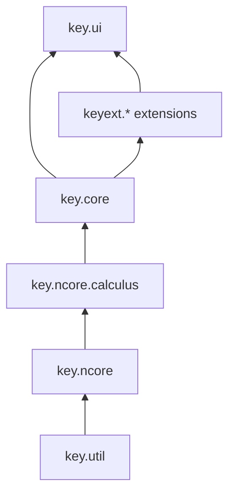

# Architecture Overview

*2026 — module list checked against `settings.gradle` of the KeY repository.*

KeY is organized as a multi-module Gradle build. The modules fall into four
groups: foundations, the core prover, the user interface, and optional
extensions (`keyext.*`).

## Foundations

| Module | Purpose |
|---|---|
| `key.util` | Utility library used by all other modules. |
| `key.ncore` | Generic data structures for terms and formulas, *independent of a target programming language*. |
| `key.ncore.calculus` | Generic calculus infrastructure built on `key.ncore`. |

## Core prover

| Module | Purpose |
|---|---|
| `key.core` | The heart of KeY: terms, sequents, taclets and built-in rules, the proof search strategy, parsers for Java/JML/KeY files, proof obligations, proof loading/saving, proof scripts, and the SMT translation. Java sources are parsed with [JavaParser](https://javaparser.org/) (`de.uka.ilkd.key.java.JavaService`); JML is parsed by the `njml` parser (`de.uka.ilkd.key.speclang.njml`), and `.key` files by the ANTLR4-based `nparser` (see [New KeY parser](../NewKeyParser/)). |
| `key.core.infflow` | Information-flow (non-interference) proofs. |
| `key.core.wd` | Well-definedness checks for specifications. |
| `key.core.symbolic_execution` | API for using KeY as a symbolic execution engine (basis of the Symbolic Execution Debugger). |
| `key.core.testgen` | Test case generation based on proof attempts. |
| `key.core.proof_references` | API for maintaining references between objects in proofs. |
| `key.core.example`, `key.core.symbolic_execution.example` | Minimal examples for using the respective APIs. |

Important packages in `key.core` (`de.uka.ilkd.key.*`):

- `logic`, `ldt` — terms, sorts, language data types (heap, sequences, …)
- `rule`, `strategy` — taclets, built-in rules, automated strategy
- `proof`, `prover`, `control` — proof object, prover engine, user-interface control layer
- `java`, `speclang`, `nparser` — Java/JML/KeY-file front ends
- `macros`, `scripts` — proof macros and proof script commands
- `smt` — SMT solver integration
- `settings` — proof-dependent and proof-independent settings

## User interface

| Module | Purpose |
|---|---|
| `key.ui` | The Swing GUI (`de.uka.ilkd.key.gui`), including the [GUI extension API](../GUIExtensions/) (`de.uka.ilkd.key.gui.extension.api.KeYGuiExtension`). The UI is organized with the [Docking Frames](https://docking-frames.org/) library. |

## Extensions (`keyext.*`)

These modules plug into the UI via the GUI extension mechanism and are good
templates for your own extensions (see [Extending KeY](../ExtendingKeY/)):

| Module | Purpose |
|---|---|
| `keyext.exploration` | [Proof exploration](../../user/Exploration/) ("what if" edits to sequents). |
| `keyext.slicing` | [Proof slicing](../../user/ProofSlicing/). |
| `keyext.caching` | [Proof caching](../../user/ProofCaching/). |
| `keyext.proofmanagement` | Management of larger verification projects. |
| `keyext.isabelletranslation` | [Translation of proof obligations to Isabelle](../../user/IsabelleTranslation/). |
| `keyext.ui.testgen` | UI for test case generation. |

## Extension mechanisms at a glance

KeY uses Java's `ServiceLoader` throughout for pluggability. Registration
files live in `src/main/resources/META-INF/services/`. Notable service
interfaces:

- `de.uka.ilkd.key.gui.extension.api.KeYGuiExtension` — GUI extensions
- `de.uka.ilkd.key.scripts.ProofScriptCommand` — proof script commands
- `de.uka.ilkd.key.macros.ProofMacro` — proof macros
- `de.uka.ilkd.key.proof.init.POExtension` — proof obligation extensions
- `de.uka.ilkd.key.proof.init.loader.ProofObligationLoader` — loaders for proof obligations
- `de.uka.ilkd.key.proof.init.DefaultProfileResolver` — profile resolution

See [Extending KeY](../ExtendingKeY/) for a how-to.
