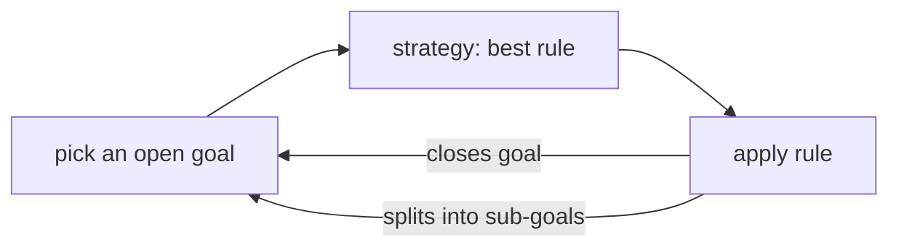
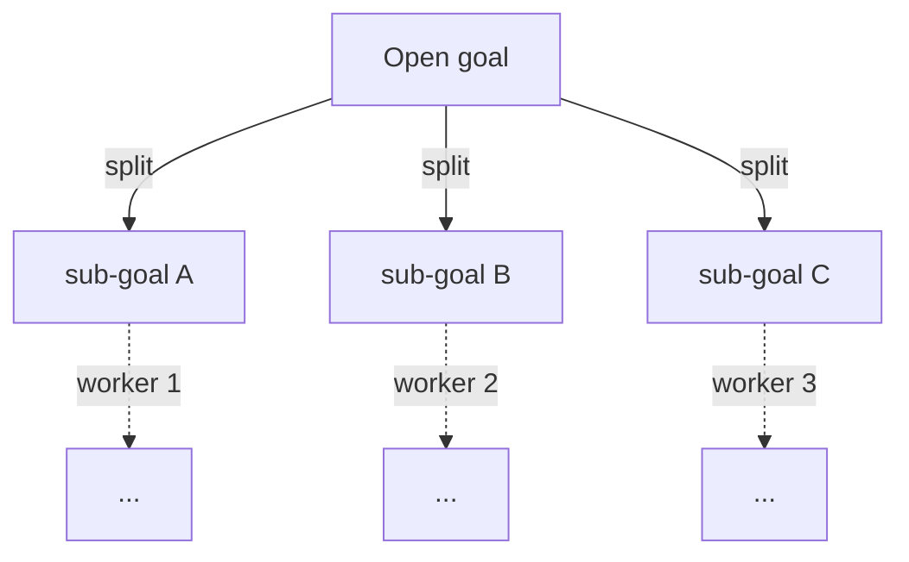
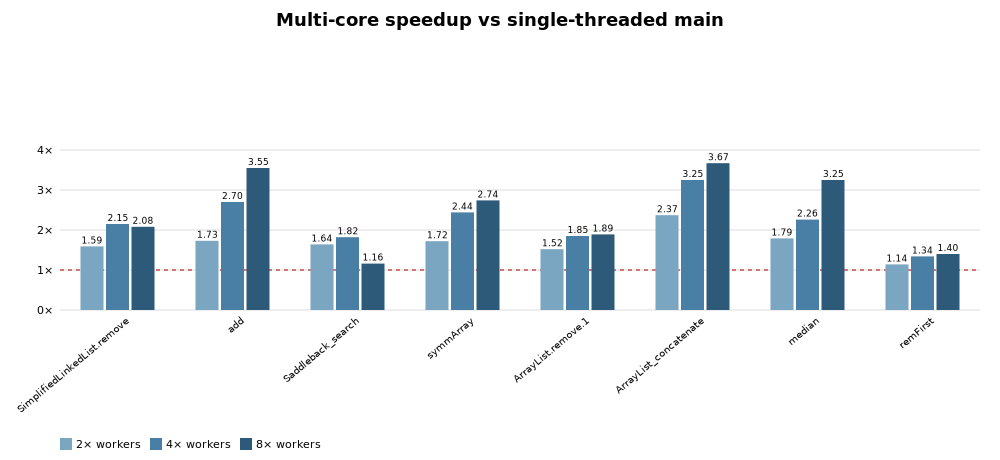

# Multi-Core Proving

KeY can run its automatic proof search on several processor cores at once. This
page explains what that means, what it gains, and how it is built. It stays at the
conceptual level. If you write prover code, read
[Thread Safety and Determinism](ThreadSafety.md) as well.

## Why

A hard proof can take minutes. The machine running it has many cores, and the
classic prover uses one of them. Automatic proof search splits naturally into
independent pieces, so the idle cores can be put to work.

## Background: how automatic proving works

Three notions are needed.

A **proof** in KeY is a tree. Its leaves that still need work are the **open
goals**. The proof is finished once no open goal is left.

A **rule** replaces one goal by zero, one, or several new goals. A rule that
produces zero goals *closes* that goal. A rule that produces several performs a
**split**: a case distinction, an `if`, etc.

The **strategy** is the part of KeY that decides what to do at a goal. It scores
every rule that could be applied there and picks the cheapest.

Automatic search is then a single loop:

1. pick an open goal,
2. ask the strategy for the best rule at that goal,
3. apply it, which either closes the goal or replaces it with sub-goals,

until nothing is open or no rule applies anywhere. What one such step involves is
described in [the rule-application pipeline](RuleApplicationPipeline.md).

The single-core and the multi-core prover both run this loop. They differ only in
how many goals they work on at a time. The rules, the strategy, and the validity
of the result are the same.

## What the multi-core prover does

A **thread** is an independent sequence of steps that the machine executes.
Several threads run at the same instant on different cores. A thread that proves
is called a **worker** here.

The goals that a split produces are **independent**: proving one of them does not
affect its siblings. The multi-core prover uses this. It gives each open goal to a
worker, so the siblings are proved at the same time.

The single-core prover remains the default and the fallback.

## What it gives, and what it does not

**Speed, limited by the shape of the proof.** A proof is only as parallel as its
widest point. Workers beyond that number have nothing to do. Proofs that split a
lot gain the most. A proof that is one long chain of goals gains almost nothing,
no matter how many cores are available.

**The same proof (as far as the evidence allows) found every time.** Determinism is
a property worth having: a proof found once will be found again. Whoever checks it
then sees the same numbers, and, more importantly, a proof that still closes within
the same step bound.

To that end the multi-core prover has been vetted several times against the test
proof collection. At the time of writing we found no run that produced differing
numbers, which does not mean none exists. As far as we know, it is empirically as
deterministic as the single-core prover. Several of the problems found on the way
were latent on the single-core prover too, and were fixed while the multi-core
prover was built.

## Design

Everything below follows from one decision: **isolate rather than lock**.

When two workers change the same data at the same moment, the outcome is
undefined: entries disappear, readers see nonsense. The standard defence is a
**lock**, which admits one worker at a time to a piece of code. Locking the shared
prover state would be correct, but it would also remove the parallelism, because
the workers would spend their time queueing for it.

The prover therefore divides the state instead of sharing it. Each worker gets its
own. The one thing that cannot be divided, the proof tree itself, is the only
thing a lock protects.

This pays off because of where the time goes. Applying a rule has an expensive
part, finding which rules fit the goal and scoring them, and a cheap part,
inserting the result into the tree. The expensive part dominates, and it only
reads data that nobody is changing, so it needs no lock. Only the insertion is
serialised, and it is brief.

### Scheduling

One queue hands goals to the workers **depth first**: a worker follows one branch
downwards, and the siblings of a split wait until some worker is free to take
them. Every open goal costs memory, and this keeps their number down to roughly the
depth of the proof per worker, rather than the full width of the tree. It is also
the same order the single-core prover uses.

Taking that order over does not make the two the same prover. Set the worker count
to one and you get the multi-core prover with a single worker, not the single-core
prover: the same goals in the same order, and on every proof measured the same
proof, but a different engine running them. What that engine costs is the "1
worker" column of the table in [Measured speedup](#measured-speedup).

### What a worker has to itself

- **Its goal.** One worker works on a goal at a time, so code that only uses what
  it reaches through its own goal is safe without any further thought.
- **Fresh names.** Proving invents new symbols. Each worker draws them from its
  own reserved region of the name space, so two workers cannot invent the same
  name.
- **Scratch memory** for the computation it is currently doing.

What stays shared is read-mostly: the rules themselves, and caches. Caches written
during the search use structures built for concurrent use.

### What is switched off during a run

- **Listeners.** A listener is code that asks to be told whenever the proof
  changes. The GUI, proof caching and proof slicing all listen. They would be
  called on a worker thread, which they are not built for, so every listener not
  needed for proving is detached for the run and restored afterwards. The views
  refresh once from the finished proof.
- **The merge rule** is not safe under concurrency and turns itself off while more
  than one worker is active.

### Profile gating

A **profile** is a bundle of rules and settings for one kind of verification. Only
the standard Java profile proves in parallel. The well-definedness,
information-flow and symbolic-execution profiles keep the single-core prover,
because their rules have not been reviewed for concurrent use.

## Single-core-only features

Three features are off while the multi-core prover is active and return when you
switch back:

- **proof caching**, which closes a goal by pointing at an existing proof;
- **proof slicing**, whose dependency tracking does not record during parallel
  runs;
- **the merge rule**, disabled in the engine; its strategy option reads *skip* and
  is greyed out.

The GUI reflects this: the affected buttons grey out with a tooltip explaining
why, and the status line names the active prover. Since single-core is the
default, these features are unaffected unless you switch deliberately.

## Configuration

The prover is a single setting, and **single-core is the default everywhere**.

- **GUI**: *Settings, Prover (Single / Multi-Core)*, with a worker count between 1
  and the number of cores. The status-line indicator (`SC`, or `MT N x`) switches
  prover on left-click and offers the worker count on right-click.
- **CLI**: `--threads N` proves with `N` workers. Omit it for single-core.
- **Tests**: the suite is pinned to single-core. A test that wants the multi-core
  prover switches to it itself, and asserts that it got it, so a test cannot
  quietly prove single-core and report success without having tested anything.

Proof scripts and macros use the multi-core prover when it is active and the
profile permits. `TryClose` is a deliberate exception and always runs single-core.
It closes goals one at a time under a tight budget of steps per goal. A single
goal offers no parallelism to begin with, and several workers exploring it apply
rules in a less step-efficient order, which can exhaust the budget before the goal
closes and so discard a provable goal. A run returns only once every worker has
stopped, so whatever follows it sees a settled proof.

## Verification

- **Equivalence.** A fixed corpus is proved both ways and the results compared by
  a structural fingerprint that ignores the order in which branches were explored.
  The closed or open outcome must agree.
- **Single-core determinism.** The same corpus is proved twice single-core in one
  JVM, and the two trees must be identical. No threads are involved, so a failure
  here is exactly reproducible.
- **Stress.** Splitting proofs run repeatedly at eight workers, more than the
  machine comfortably sustains, and every run must close. A proof script runs
  under the multi-core prover, and its proof is then saved and reloaded
  single-core and must still be closed, which shows that a multi-core proof is an
  ordinary, portable proof.

All of this runs in CI: the equivalence and determinism checks together with the
ordinary unit tests, and the stress tests in their own job. Two further jobs prove
a small corpus with two and four workers (`testMt2w`, `testMt4w`, `testMtStress`).

## Measured speedup

Wall-clock time of automatic search compared with the single-core prover, on a
16-core machine, measured on commit
[`4d8f9ca7f1`](https://github.com/KeYProject/key/commit/4d8f9ca7f17156bb4ed0fcf533a9dbbceb5fcfdb).
Every figure is the median of three runs. A single run is not steady enough to
quote: across the three, `SimplifiedLinkedList.remove` came out at 3.57, 3.05 and
3.65 at eight workers. The "1 worker" column is the multi-core prover given a
single worker, which shows what its machinery costs when there is no parallelism
to be had.

| Proof | single-core (s) | 1 worker | 2 workers | 4 workers | 8 workers |
|---|---|---|---|---|---|
| SimplifiedLinkedList.remove | 17.6 | 1.08x | 1.67x | 2.79x | 3.57x |
| gemplusDecimal/add | 8.9 | 1.00x | 1.80x | 2.87x | 3.70x |
| Saddleback_search | 10.7 | 1.00x | 1.79x | 2.61x | 2.22x |
| symmArray | 11.6 | 1.01x | 1.59x | 2.12x | 2.28x |
| ArrayList.remove.1 | 2.7 | 1.00x | 1.54x | 1.78x | 1.85x |
| ArrayList_concatenate | 10.4 | 1.29x | 2.36x | 3.27x | 4.36x |
| median | 3.1 | 1.04x | 1.76x | 2.42x | 3.38x |
| ArrayList.remFirst | 0.7 | 1.05x | 1.24x | 1.52x | 1.48x |

That machinery costs nothing measurable: at one worker the two provers are level,
and on `ArrayList_concatenate` the multi-core one is even ahead. Both find the same
proof there, so the difference is in how the two pick their next goal, not in
parallelism.

The best cases reach 3.4 to 4.4 at eight workers. Narrow proofs do not.
`Saddleback_search` is dominated by one long branch (relatively few branches): it peaks 
at four workers and falls back at eight, where the extra workers only poll on an empty queue. 
`ArrayList.remFirst` closes in under a second and has too little to share out. What a proof 
can reach is set by its widest point, not by the number of cores.

## Future directions

- **Returning the switched-off features.** Each comes back on its own, after a
  parallel-safety review with its owner, by being given a safe way to observe the
  search rather than being called on a worker.
- **Parallelism inside one goal.** This page is about proving several goals at
  once. Scoring the rule candidates of a single goal in parallel is a separate,
  independent idea, left for later.
