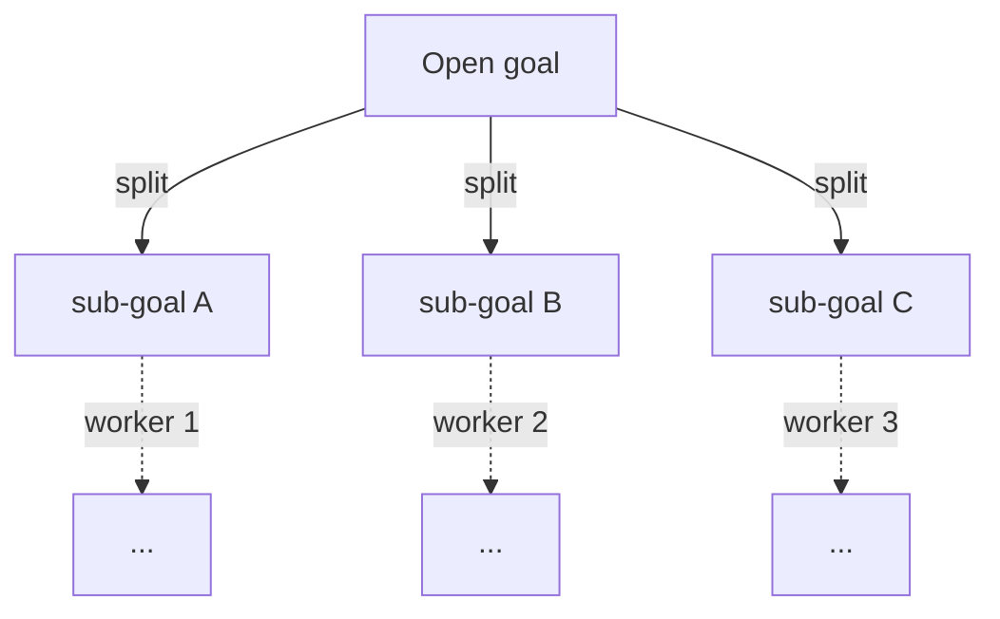
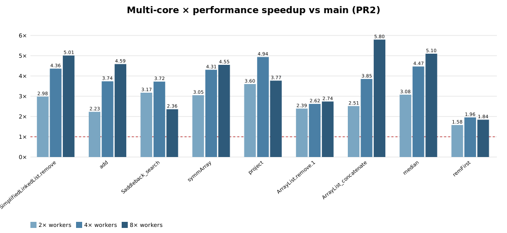

# Multi-Core Proving

*2026 — goal-level parallel automated proof search.*

This page documents the multi-core (parallel) prover, a port and modernisation
of the 2018 *HacKeYthon* multithreading prototype. It is described here at the
conceptual and design level (not the implementation); the code lives in the
linked pull requests. Two PRs cover the work:

| PR | What | Default |
|---|---|---|
| [Multithreading (standalone)](#) — *PR1* | The parallel prover on its own, applicable to `main` | multi-core (4 threads) in the PR build; single-core once merged |
| [Multithreading × perf series](#) — *PR2* | PR1 integrated with the [3.1 performance series](PerformanceOptimizations.md) | preview branch |

Both fall back safely to the legacy single-threaded prover, which stays the
default on `main`.

## The prover loop

Automated proof search is a **tree search**. The proof tree has the open goals at
its leaves; the prover repeatedly:

1. **picks an open goal**,
2. asks the **strategy** for the best applicable rule at that goal, and
3. **applies** it — which either closes the goal or replaces it with one or more
   sub-goals (a *split*),

until every goal is closed or no rule applies anywhere. This is the
[rule-application pipeline](RuleApplicationPipeline.md) — *matching → strategy
evaluation → application* — run in a loop.

The **single-core** and **multi-core** provers are two *drivers* of this same
loop. They differ only in **how they pick and process goals** — sequentially, or
several at once — not in the rules, the strategy, or the resulting proofs' validity.

## The single-core prover

The legacy prover walks the tree **one goal at a time** on the calling thread:
pick a goal, apply a rule, repeat. It is the default and the safe fallback. Its
behaviour is deterministic and every feature of KeY is built against it.

!!! warning "Status: open pull request"
    The multi-core prover described below is **not yet merged** — it is currently
    an open pull request. This page documents the proposed feature; details may
    still change during review.
    *([pull request #3842](https://github.com/KeYProject/key/pull/3842))*

## The multi-core prover

Sibling goals produced by a split are **independent** — a case distinction, an
`if`, a loop unwinding yield goals whose proofs do not interfere. The multi-core
prover exploits this by assigning **one worker thread per open goal** and proving
the siblings concurrently.

The speedup is bounded by the **longest branch** (Amdahl's law): proofs that split
widely (heavy symbolic execution, many case distinctions) benefit most, while a
narrow proof with one long branch barely improves. The parallel search is
**sound but not identical** to the single-threaded one — it may find a different,
equally valid proof, since the order in which goals are explored differs.

## Design of the multi-core prover

The guiding principle is **isolation, not locking**: rather than wrap the shared
mutable proof state in locks, the workers are kept from touching it concurrently
in the first place, and the one unavoidable point of contention — mutating the
shared proof tree — is serialized. Concretely: **partition mutable state per
worker, and serialize only the proof-tree commit.** The expensive part of proving
(roughly 95 %: taclet matching and strategy-cost computation) then runs lock-free
on effectively-immutable inputs; the only shared mutation, inserting nodes into
the tree, is brief and serialized.

This is the lesson of the 2018 *HacKeYthon* prototype, whose three failure modes
each map directly to a part of the design:

| 2018 failure mode | Why it failed | The cure here |
|---|---|---|
| **Naming not thread-safe** | A shared global name space was locked, yet two workers could still invent the same fresh name | Mint names from **per-worker disjoint spaces** |
| **Locking out of control** | `synchronized` was retrofitted onto structures never meant to be shared (name spaces, caches, indices) | Keep those **goal-local**; lock only the tree commit |
| **Listeners on the worker thread** | Applying a rule fired every listener synchronously on the worker — caching, slicing, GUI all attached there | **Detach** non-essential listeners for the run |

A prerequisite that `main` already provides made this feasible: strategy features
are **stateless** and take their working state explicitly (`MutableState`), which
was the single biggest correctness blocker in 2018.

### Compute and commit

A rule application has an expensive part (selecting the rule and **matching** it,
plus cost computation) and a cheap part (**inserting** the result into the proof
tree). These are separated into a **compute** phase that runs concurrently off any
lock, and a **commit** phase that runs under a single lock. Only the tree mutation
is serialized; the matching and cost work, which dominate the cost, run in
parallel.

### Scheduling

A single work queue hands open goals to the workers **depth-first**: each worker
dives down one branch while a split's siblings wait for other workers to pick them
up. This keeps the set of simultaneously-open goals small (roughly the proof depth
per worker) rather than the whole breadth of the tree — a smaller, eviction-friendly
working set — and matches the order the single-threaded chooser uses.

### Isolation mechanisms

For the duration of a run:

- **Listeners** not essential to proving (GUI, proof caching, slicing) are
  detached, so nothing unrelated to the search fires on a worker thread. This
  covers both the proof-level listeners (proof-tree and rule-application) *and*
  the per-goal listeners attached directly to each `Goal`; the latter are easy to
  overlook because they live outside the proof's listener lists, yet they would
  otherwise fire on a worker and touch Swing off the EDT. The views are refreshed
  once from the final proof state when the run ends and the listeners are restored.
- **Fresh names** come from a per-worker partition of the name space, so workers
  never mint colliding names.
- **Shared search caches** (matching, cost) use thread-safe cache structures, and
  parametric operators and updates are interned identity-preservingly.
- **Rules not yet safe under concurrency** — the merge rule — disable themselves
  while a multi-worker run is active.

### Profile gating

Only the standard Java profile runs in parallel. The well-definedness,
information-flow and symbolic-execution profiles keep the single-threaded prover,
since their rules and side-proof machinery have not been audited for thread-safety.

### Problems encountered, and how they are resolved

Four classes of concurrency bug appeared during development; each is resolved at
the design level and guarded by a regression test.

- **Lost goals (non-closure).** Sibling goals share one taclet-index cache whose
  key was a single mutable object reused per lookup; concurrent workers raced on
  it, occasionally reading the index for the wrong term, dropping a goal and
  leaving the proof nondeterministically open. *Resolution:* an immutable,
  per-lookup key — no shared mutable state to race on. The bug reproduced in ~50%
  of 8-worker runs before, **0** after.
- **Early termination.** A worker could observe the queue mid-update — a goal no
  longer in flight, its successors not yet offered — and wrongly conclude the
  search had finished. *Resolution:* completing a goal and offering its successors
  is a single atomic step.
- **Shared-state hazards.** A systematic audit hardened the remaining shared
  proving state (instantiation caches, type caches, the specification repository,
  static interners). Each is a separate, behaviour-preserving change.
- **Off-EDT view updates.** Per-goal listeners — attached to individual `Goal`s
  rather than the proof, and therefore outside the proof-level suspension — kept
  firing on worker threads and touched Swing off the event-dispatch thread.
  *Resolution:* the suspension covers per-goal listeners too, and the views are
  refreshed once from the final proof state after the run (see *Isolation
  mechanisms*).

### Future directions

- **Cooperative features.** The single-core-only features are re-enabled one at a
  time, each with an explicit parallel-safety review with its owner, by defining a
  safe way to observe the search (e.g. events batched and drained on one thread, or
  inspected after the run) instead of firing on a worker.
- **Intra-goal parallelism.** This work parallelises *across* goals. A second,
  orthogonal axis — parallelising the cost/feature computation *within* a single
  goal (also prototyped in 2018) — is deferred to a later optimisation phase once
  goal-level parallelism is stable.

## Single-core-only features

While the multi-core prover is active, three features are switched off and
restored when you switch back, because they are not safe under
concurrent goal processing:

- **Proof caching** — closes goals by reference to other proofs during search;
- **Proof slicing** — its dependency tracker does not record during parallel runs;
- **The merge rule** — disabled at the engine level; the strategy option is shown
  as *skip* and greyed.

The GUI reflects this live: the proof-caching button and the slicing actions grey
out with an explanatory tooltip, and the status line shows the active mode. These
restrictions will be lifted incrementally, together with the feature owners, once
the multi-core prover is confirmed safe for the relevant subset. **Because the
default on `main` is single-core, all of these features remain available exactly
as before.**

## Configuration

The prover mode is one persisted setting, surfaced everywhere:

- **GUI** — *Settings → Prover (Single / Multi-Core)*: choose legacy single-core
  or multi-core with a worker count (1…cores). The status-line indicator
  (`SC` / `MT N×`) toggles the mode on left-click; right-click chooses the worker
  count.
- **CLI** — `--threads N` runs automatic search on the multi-core prover with `N`
  workers (omit for single-core).
- **Tests** — the suite is pinned to single-core (`-Dkey.prover.parallel=false`);
  individual tests opt into the parallel prover at runtime. The system property
  `-Dkey.prover.parallel[.threads]` overrides the setting.

Proof scripts and proof macros run on the multi-core prover when it is active and
the profile supports it, with one deliberate exception: `TryClose` (and the
`Full Auto` pilot that ends in it) closes goals **one at a time under a tight
per-goal step budget**, and is pinned to the single-core prover. A single goal
offers no parallelism anyway, and several workers exploring its subtree apply
rules in a less step-efficient order than the single-threaded chooser, which can
exhaust the budget *before* the goal closes — leaving a provable goal pruned. Wide,
generously-budgeted runs keep using the multi-core prover; only this budget-bound,
single-goal-at-a-time pattern opts back out. Either way a run only returns once
every worker has stopped, so pruning sees a quiescent proof.

## Verification

- **Equivalence gate** — a curated corpus is proved single- and multi-threaded
  and the two results are compared by a structural proof *fingerprint* that ignores
  the order in which branches were explored: the closed/open outcome must match
  (sound, not byte-identical, per above). This is the regression net the 2018
  effort lacked.
- **Stress tests** — splitting proofs run at an over-subscribed eight workers,
  repeatedly, asserting every run closes; a separate test exercises the macro
  prune-and-close path. A third test runs a real, position-sensitive **proof
  script** (quicksort `sort.script` — a parallel macro followed by literal
  `select`/`rule` commands referencing fresh names) under the multi-core prover and
  then **saves the multi-core proof and reloads it single-core**, asserting it is
  closed — i.e. scripts keep working and a multi-core proof is a normal, portable
  artifact. Each stress class runs in its own JVM (`forkEvery = 1`) so global state
  cannot leak between them. Wired into the CI integration-test matrix.

> *8-worker stress evidence (16-core): `MtStressTest` 2/2, `MtMacroStressTest` 1/1,
> `MtScriptStressTest` 2/2 — all green on both the multithreading branch and the
> combined multithreading × performance branch.*

## Combined effect

Automode wall-clock speedup vs single-threaded `main` (16-core, one isolated run
per proof; the `4×` column is the practical sweet spot):

| Proof | main | 4× (MT) | 4× (MT × perf) |
|---|---|---|---|
| SimplifiedLinkedList.remove | 27.9s | 2.82× | 4.36× |
| gemplusDecimal/add | 10.8s | 2.32× | 3.74× |
| symmArray | 20.3s | 1.83× | 4.31× |
| ArrayList_concatenate | 13.0s | 3.34× | 3.85× |
| arith/median | 4.4s | 2.22× | 4.47× |
| Saddleback_search (narrow) | 22.5s | 1.29× | 3.72× |

The performance series and the multi-core prover compose: cheaper single-threaded
matching/allocation shrinks the cost of each rule application *and* of the parallel
prover's off-critical-path speculation, so the combined branch reaches ~4–5× on
wide proofs and even lifts the narrow worst case (Saddleback regresses to 0.70× at
eight multithreading-only workers, but the combined branch holds 2.36× there and
3.72× at four).

Per-proof speedup vs single-threaded `main`, multithreading only:

And with the performance series underneath (the combined branch), where even the
narrow Saddleback proof no longer regresses at eight workers:

The realistic ceiling per proof is set by its widest concurrency, not the worker
count: wide, splitting proofs scale well to 4–8 workers; narrow proofs (one long
branch) stay near 1×. The synthetic best/worst-case benchmark makes this explicit.
