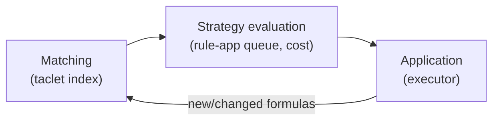
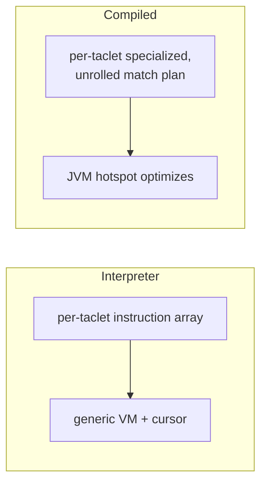
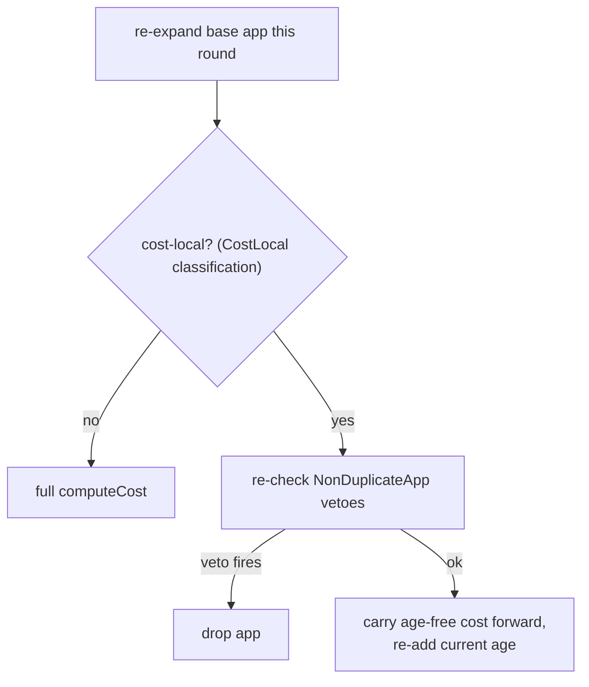
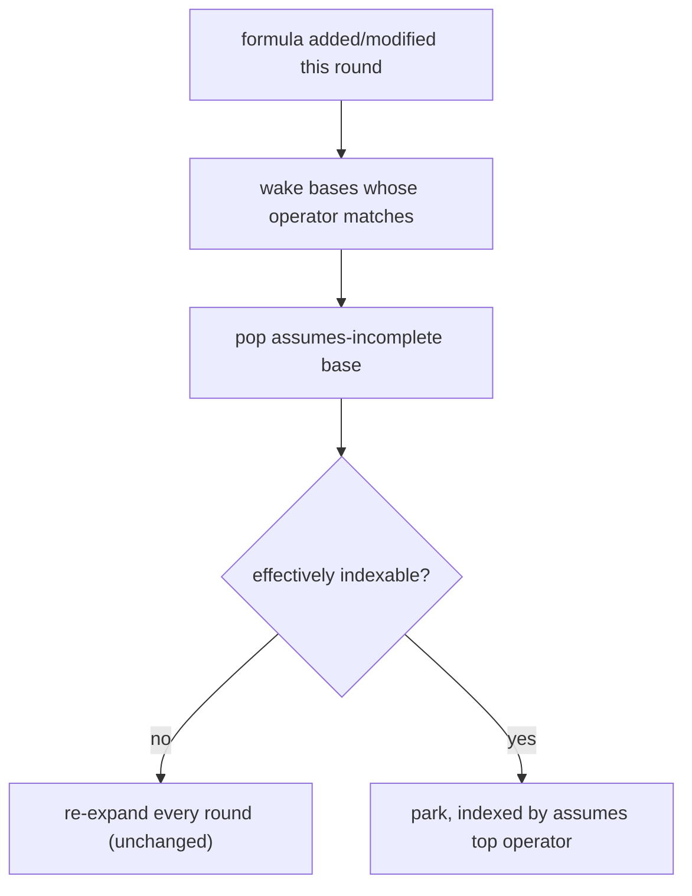
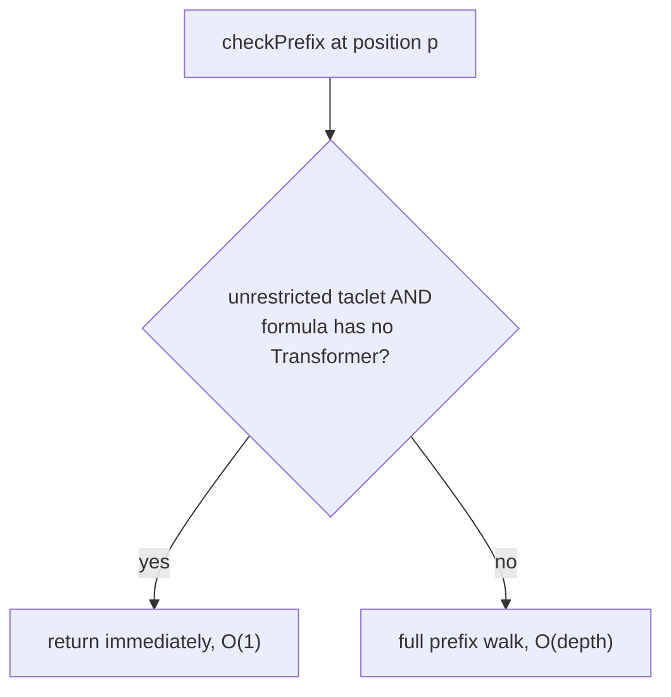

# Performance Optimizations (3.1 series)

*2026 — a round of performance work on the automated proof search.*

This page documents the "3.1" performance series. Each optimization targets
one stage of the [rule application pipeline](../RuleApplicationPipeline/) —
**matching → strategy evaluation → application** — which is the hot loop of
automated proving. They are described here at the conceptual level (previous
design, the problem, the chosen solution); the code lives in the linked pull
requests.

| Stage | Optimization | Status | PR |
|---|---|---|---|
| Matching | Compiled taclet matcher | default (interpreter opt-out) | [#3831](https://github.com/KeYProject/key/pull/3831) |
| Strategy evaluation | Rule-app cost reuse + age as cost term | default | [#3837](https://github.com/KeYProject/key/pull/3837) |
| Strategy evaluation | Operator-indexed parking of assumes-incomplete bases | default | [#3838](https://github.com/KeYProject/key/pull/3838) |
| Application | Skip the prefix walk when no transformer is present | default | [#3836](https://github.com/KeYProject/key/pull/3836) |
| Cross-cutting | Reduce proof-search allocations | default | [#3835](https://github.com/KeYProject/key/pull/3835) |

All of these are **active by default** — a checkout needs no configuration. For
the compiled matcher the legacy interpreter remains available as an opt-out
(feature flag / `-Dkey.matcher.interpreter`).

The combined effect on a set of six real-world proofs is a **1.74× automode
speedup** (see [Combined effect](#combined-effect)).

## Matching: the compiled taclet matcher

*Default — the legacy interpreter is an opt-out (Settings → Feature Flags
*MATCHER_INTERPRETER*, or `-Dkey.matcher.interpreter`; reload to apply).
[#3831](https://github.com/KeYProject/key/pull/3831).*

**Previous design.** Every taclet's `\find` pattern is matched by an
interpreter (`VMTacletMatcher`): the pattern is compiled into a flat array of
matching instructions, and a generic VM walks each candidate term with a
cursor, stepping an instruction pointer (see
[the pipeline](../RuleApplicationPipeline/#inside-vmtacletmatcher-the-matching-vm)).
Matching is one of the most frequently executed operations in the prover, and
the generic cursor navigation is a large part of its cost.

**The problem.** A single interpreter loop drives every taclet, so each match
pays for generic dispatch and cursor bookkeeping that, for a *given* taclet,
is fully predictable.

**The chosen solution.** Generalize the interpreter framework into a
*compiler-like* one: the matching logic is specialized per taclet into a
partially-evaluated, unrolled representation, which the ordinary JVM hotspot
compiler then optimizes. There is no separate bytecode emission — the
specialized representation is plain Java that JIT handles well. The same
instruction set drives both the interpreter and the compiled back-end (one
source of truth; adding support for a new construct means adding one
instruction). Program and matcher state are built through a unified
`ncore` syntax-element navigation, replacing the separate program/term
matching paths.

This PR is a **foundation**: it does not speed up end-to-end proving on its
own (matching is only one stage), but it is the substrate the other PRs build
on. It was validated by differential testing (millions of comparison points,
byte-identical proofs on the functional `runAllProofs` corpus). On an isolated
find-matcher benchmark over KeY's FOL taclet base, the compiled back-end
matches roughly **6.5–8.3× faster** than the interpreter.

## Strategy evaluation: cost reuse and age

*Default. [#3837](https://github.com/KeYProject/key/pull/3837).*

**Previous design.** When a rule-app container is reconsidered across peek
rounds (`TacletAppContainer.createFurtherApps`), the strategy's full
`computeCost` — the feature-tree evaluation, the dominant CPU cost of
automode — is run again, even for a base app that has not changed. The cost
also bakes in the goal-age term, which changes every round.

**The problem.** The same cost is recomputed repeatedly for an unchanged app.
It cannot simply be cached because the age component is genuinely
round-dependent.

**The chosen solution.** Two coupled changes:

1. **Age becomes a first-class container-level cost term.** A container stores
   its *age-free* cost; the goal-age contribution is re-added by
   `RuleAppContainer#withAge` when the container (re-)enters the queue. This
   removes age from the stored value and is the enabler for reuse.
2. **Cost reuse.** When a taclet's cost is a pure function of the app and its
   find-subterm (plus the now-separate age term and the `NonDuplicateApp`
   vetoes), the stored age-free cost is carried forward verbatim instead of
   recomputed. Eligibility is decided by a *sound-by-construction*,
   annotation-driven classification (`@CostLocal` / `@CostNonLocal`): a taclet
   is eligible only if every feature reachable in its cost bindings is
   explicitly marked local; anything unannotated is treated as non-local (the
   safe default — a missing annotation costs performance, never soundness).
   The vetoes that can still fire are re-checked on every reuse.

The result is byte-identical on the perfTest/perfValidation corpora; the win
is reduced `computeCost` time on cost-bound proofs.

## Strategy evaluation: parking assumes-incomplete bases

*Default. [#3838](https://github.com/KeYProject/key/pull/3838).*

**Previous design.** A taclet whose `\assumes` clause is not yet matched
enters the queue as an *assumes-incomplete base*. Each round it is popped and
re-expanded to look for a matching assumes-formula on the sequent.

**The problem.** Profiling shows this is the dominant remaining queue churn:
96.8% of queue pops fail at an unmatched `\assumes`, and 97–99.6% of the
resulting re-expansions produce nothing — the base is popped and re-expanded
every round only to discover that nothing it needs has appeared.

**The chosen solution.** Park such a base out of the active queue and wake it
only when a formula it could actually match appears. A base whose assumes top
operators are *effectively indexable* (each is concrete, or a schema variable
already bound by the find-match) is indexed by those operators. On each round,
exactly the parked bases whose operator matches a formula **added or modified
that round** are woken — the same round their non-parked counterpart would
first see that formula as "new". Bases with an unbound-generic assumes top
(which could match anything) are never parked and behave exactly as before.

Because a woken base re-expands on the identical round with the identical age
and cost, the parking mechanism is order-preserving; over-waking is harmless
(a spuriously woken base re-expands to nothing and re-parks), and only
*missing* a wake could diverge — which cannot happen for an indexable base.
This PR also drops the order-fragile `lenOfSeqSubEQ` heuristic from automode
(it is redundant for completeness and could dead-end a goal under rule
reordering), making automode robust to scheduling changes.

## Application: skipping the prefix walk

*Default. [#3836](https://github.com/KeYProject/key/pull/3836).*

**Previous design.** `RewriteTaclet.checkPrefix` walks the whole
root-to-position prefix at every position it is asked about, to handle update
context, polarity and modality restrictions and to veto a `Transformer` on
the path.

**The problem.** On a deep term that walk is O(depth) per position over many
positions — O(d²) overall, which dominates on deeply nested terms (e.g.
chained if-then-else).

**The chosen solution.** For an unrestricted (`NONE`) rewrite taclet — the
common case — the only prefix-dependent outcome is the `Transformer` veto;
the update/polarity/modality handling is guarded by a non-`NONE` restriction
and the polarity is discarded. So if the formula provably contains no
`Transformer` anywhere, the walk can be skipped. "Contains a `Transformer`" is
computed once and cached per term, making the check O(1) amortized.

Behaviour-preserving (it short-circuits a provably-equivalent case). On
shallow real-world proofs the effect is marginal; on a synthetic depth-400
nested if-then-else it is roughly 2.7× faster.

## Cross-cutting: reducing allocations

*Default. [#3835](https://github.com/KeYProject/key/pull/3835).*

**Previous design / problem.** Proof search allocates a large volume of
short-lived objects on its hottest paths, driving GC. A JFR profile attributed
~20% of allocations to `removeIrrelevantLabels` alone, which rebuilt the whole
term tree on every call even when nothing changed.

**The chosen solution.** Four independent, behaviour-preserving changes
(proofs stay byte-identical):

- `removeIrrelevantLabels` does an identity-preserving rebuild — it returns the
  original (immutable) term whenever its subtree has no irrelevant label,
  instead of rebuilding via streams;
- `Pair.hashCode` computes its value without the varargs array
  `Objects.hash` allocates (Pair is a heavy hash-map key);
- the rewrite-taclet executor walks the find-position by index instead of
  allocating a position iterator per application;
- the ANTLR parser DFA cache (~17 MB, a pure cache) is released once loading
  finishes, so it does not stay resident during proof search.

## Combined effect

*Umbrella: [#3839](https://github.com/KeYProject/key/pull/3839).*

Measured on six real-world problems (the `perfTest` group of `runAllProofs`),
median of three runs, all four default-on optimizations vs. `main`:

| Problem | main (ms) | all four (ms) | speedup |
|---|--:|--:|--:|
| symmArray | 23346 | 12682 | 1.84× |
| gemplusDecimal/add | 12113 | 8661 | 1.40× |
| ArrayList.remove.1 | 3907 | 2625 | 1.49× |
| SimplifiedLinkedList.remove | 31367 | 18157 | 1.73× |
| Saddleback_search | 25710 | 13941 | 1.84× |
| coincidence_count/project | 5330 | 2396 | 2.22× |
| **Total** | **101773** | **58462** | **1.74×** |

Per-PR contribution on the same six problems (each alone vs. `main`): memory
1.12×, checkPrefix 1.01× (deep terms ~2.7×), cost reuse + age 1.07×, parking
1.44×. The compiled matcher ([#3831](https://github.com/KeYProject/key/pull/3831))
is not included in this number — it is a separate change (not part of the combined
four-PR measurement) and is the foundation for further work rather than an
end-to-end speedup by itself.
