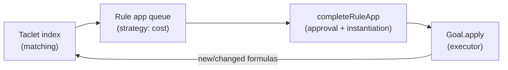

# The Rule Application Pipeline

*2026: class names and the described control flow checked against the
current sources (`key.core`, `key.ncore.matcher`, `key.ncore.calculus`).*

This page explains what happens between "a taclet exists" and "a rule has
been applied to a goal": **matching → strategy evaluation → application**.
A taclet is KeY's format for proof rules; a goal is an open proof
obligation, represented as a sequent of formulas.
It is the conceptual background for
[writing taclets](../HowToTaclet/) and for
[implementing strategies/macros](../ExtendingKeY/).

## 1. Matching: which taclets fit where?

**Per-taclet matcher.** Every taclet gets a matcher, created by
`TacletMatcherKit.createTacletMatcher(Taclet)`; the implementation is
`VMTacletMatcher` (`de.uka.ilkd.key.rule.match.vm`). Matching answers the
question "does this taclet's `\find` pattern fit this term, and if so,
what do the taclet's schema variables (the pattern's placeholders) stand
for?". A successful match yields `MatchConditions`, the collected
(partial) instantiations of the schema variables; a failed match yields
`null`. How the matcher works internally is described below.

**Indexing.** KeY does not re-match all taclets against all terms in every
round. Each `Goal` owns a `RuleAppIndex`
(`de.uka.ilkd.key.proof`), which splits into:

- a `TacletIndex` mapping top operators to candidate taclets (so only
  plausible taclets are tried at a position; there is a
  `MultiThreadedTacletIndex` variant), and
- a `TacletAppIndex` / `SemisequentTacletAppIndex` /
  `TermTacletAppIndex` hierarchy that caches, **per position in each
  sequent formula**, the set of *partial taclet applications*
  (`NoPosTacletApp`s) that match there. Because formulas are immutable
  terms, these indices are shared and only recomputed for formulas that
  actually changed after a rule application.

The products of this stage are `TacletApp` objects: a taclet plus a
position (`PosInOccurrence`) plus partial schema-variable instantiations.
At this point `\assumes` clauses are not yet matched and some schema
variables may still be uninstantiated.

### Inside the matcher

Each `\find` pattern (and each `\assumes` formula) is described once,
when the rule base is loaded, as a *match plan*. From that single
description the matcher derives its two interchangeable back-ends: the
**compiled matcher** (the default), which turns the plan into nested
matching functions, and an instruction-based **interpreter**, kept as an
independent reference and selected by the system property
`key.matcher.interpreter=true`. Both agree by construction because both
come from the same plan; a pattern the framework cannot describe is
rejected at load time with a clear error. The framework, both back-ends
and a worked example are described on the dedicated page
[Taclet matching](TacletMatching/).

**Around the match**, `VMTacletMatcher.matchFind` adds the taclet-level
concerns: if the taclet may ignore update prefixes
(`ignoreTopLevelUpdates`), leading updates of the candidate are stripped
first and stored as *update context* in the `MatchConditions` (an
`\assumes` formula must later sit under the same update context, checked
in `matchAssumes`); after a successful match, `checkConditions` validates
every instantiation against the taclet's variable conditions (`\varcond`,
`\notFreeIn`, bound-variable constraints) and rejects the match if any
fails.

## 2. Strategy evaluation: which application next?

**Feeding the queue.** Each goal has a `RuleApplicationManager`; the
default is `QueueRuleApplicationManager`
(`de.uka.ilkd.key.strategy`). It listens (as a `NewRuleListener`) to the
rule app index: whenever matching discovers a (new) taclet app, the app is
wrapped in a `RuleAppContainer` (`TacletAppContainer` /
`BuiltInRuleAppContainer`) and pushed into an immutable **priority queue**
(a leftist heap) ordered by cost.

**Costs.** The priority is a `RuleAppCost` computed by the active
strategy's `computeCost(app, pos, goal, …)` (interface
`de.uka.ilkd.key.strategy.Strategy`, building on
`org.key_project.prover.strategy.costbased`; KeY's main implementation is
`JavaCardDLStrategy`). Strategies are composed from
*feature terms* (`de.uka.ilkd.key.strategy.feature`) that add up costs;
`TopRuleAppCost` means "never apply automatically". The cost is computed
**when the app enters the queue**: it is a prediction, not re-evaluated
continuously.

**Lazy refinement.** When a container is popped, it is not necessarily
executed immediately: `createFurtherApps` lazily matches `\assumes`
(if-)formulas against the sequent and lets the strategy **instantiate**
remaining schema variables (`Strategy.instantiateApp`, e.g. choosing
quantifier instances); each refinement re-enters the queue as a new
container with a fresh cost. This is why partially instantiated apps are
cheap to index but still get accurate costs once completed.

**Selection.** `QueueRuleApplicationManager.next()` pops the minimal-cost
container and asks it to `completeRuleApp(goal)`. That final step checks
that the app is *still applicable* (the formula it points to may have been
rewritten), that matched `\assumes` formulas still exist, asks the
strategy for final **approval** (`Strategy.isApprovedApp`, a last veto,
used e.g. by the one-step simplifier discipline), fixes the
`PosInOccurrence`, and tries to fill any still-missing instantiations
(`TacletApp.tryToInstantiate`). If any of this fails, the container is
discarded and the next-cheapest one is tried.

## 3. Application: changing the proof

The automated loop lives in
`org.key_project.prover.engine.impl.DefaultProver#applyAutomaticRule`
(KeY's subclass: `de.uka.ilkd.key.prover.impl.ApplyStrategy`):

1. A `GoalChooser` (default `DefaultGoalChooser`, also
   `DepthFirstGoalChooser`) picks the next goal to work on.
2. The goal's rule app manager delivers the cheapest approved, completed
   `RuleApp` (step 2 above). If a goal has none, it is set aside.
3. `Goal.apply(ruleApp)` executes the application:
   `ruleApp.rule().getExecutor().apply(goal, ruleApp)`; for taclets this
   is `TacletExecutor` (`de.uka.ilkd.key.rule.executor.javadl`), which
   builds the new sequent(s) according to `\replacewith`/`\add`,
   creates one child goal per goal template (branch), records the rule
   application in the proof tree (`Node`), and fires `RuleAppListener`
   events.
4. The rule app indices of the resulting goals are updated **only for the
   changed formulas**; newly matching taclet apps flow back into the
   queues via the `NewRuleListener` mechanism, closing the cycle.

The loop repeats until no goal yields an applicable rule, a
`StopCondition` triggers (step limit `maxApplications`, `timeout`, or a
custom condition, e.g. from macros), or all goals are closed.

Interactive rule application takes a shortcut through the same machinery:
the UI asks the `RuleAppIndex` for taclet apps at the clicked position,
the user picks one and provides instantiations in the instantiation
dialog, and the result goes through the same `Goal.apply(…)`.

## Where to hook in

| You want to … | Hook |
|---|---|
| Change automation behavior | strategy features / a `Strategy` implementation, selectable via `StrategyFactory` (see `JavaCardDLStrategyFactory`) |
| Keep a rule out of automation | give it cost `TopRuleAppCost` (e.g. no `\heuristics` rule set, or strategy settings) |
| Observe rule applications | `RuleAppListener` on the `Proof` (see [Event listeners](../Listeners/)) |
| Run the loop with different limits/conditions | `ApplyStrategy` with a custom `StopCondition` (this is what [proof macros](../howto/AddProofMacro/) do) |
