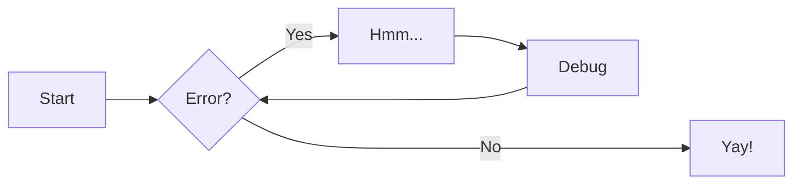
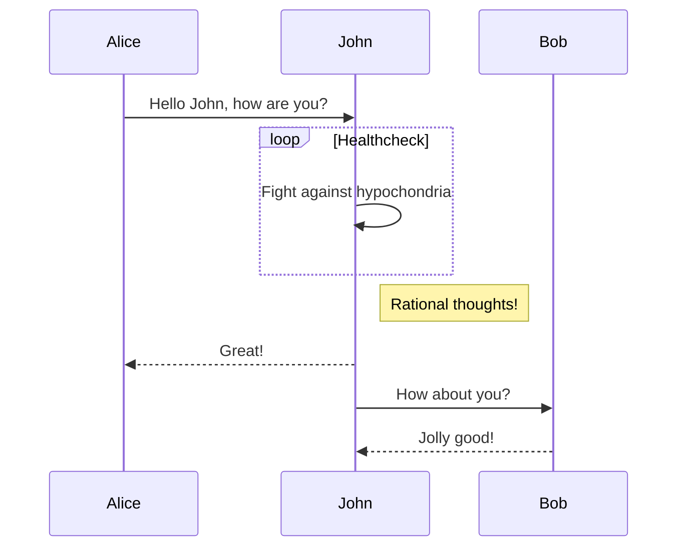
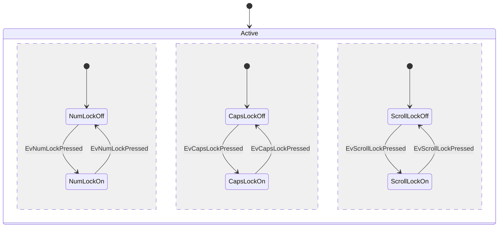
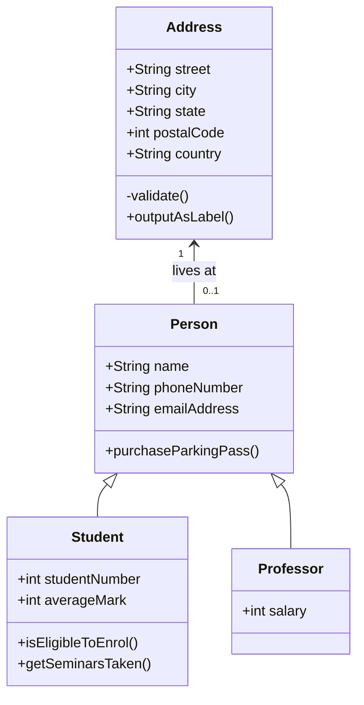
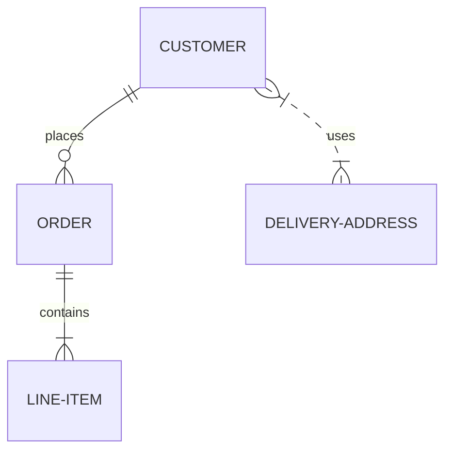

# How to write documentation

This webpage uses [mkdocs](https://mkdocs.org). Mkdocs generates from a bunch of
markdown files, and a specified template this beautiful web page.

As an author, you can just edit and create new markdown files in the `docs/` of
the corresponding repository: https://git.key-project.org/key/key-docs. On each
commit the generation is automatically started and pushed to this URL.
Therefore, *you do not need to install mkdocs on your computer.*

The project layout is very simple: There is a configuration file `mkdocs.yml`
which controls the plugins and settings for the generation. And also a content
folder `docs/` which contains Markdown files and additionally resources.


### Local setup

mkdocs is written in Python. Hence, everything you need is installable
via the Python package manager (`pip`). For a non-root user install
use either `make prepare` or execute the following line:

``` {.sh linenums="1"}
$ pip install --user  mkdocs  mkdocs-material \
                      pymdown-extensions pygments markdown-blockdiag \
                      markdown-aafigure==v201904.0004
```

This install all needed packages for this webpage inside
`$HOME/.local` and after installation the mkdocs executable should be
under `$HOME/.local/bin/mkdocs`.

serve:
	mkdocs serve

build:
	mkdocs build

## Commands

* `mkdocs new [dir-name]` - Create a new project.
* `mkdocs serve` - Start the live-reloading docs server.
* `mkdocs build` - Build the documentation site.
* `mkdocs help` - Print this help message.


---- 

### Headings

All HTML headings, `<h1>` through `<h6>`, are available. `.h1` through
`.h6` classes are also available, for when you want to match the font
styling of a heading but still want your text to be displayed inline.


## h2. Heading
### h3. Heading
#### h4. Heading
##### h5. Heading
###### h6. Heading


## Classical Markdown

https://markdown.de/

Headers are introduced with `#`. Multiple `#` increases the header level.

Paragraphs are separated by a blank line.

A 2nd paragraph. You can format your text: *Italic*, **bold**, and `monospace`.

```
*Italic*, **bold**, and `monospace`.
```

List are either introduced with `*` or `-`.
```
* this one
* that one
* the other one
```

* this one
* that one
* the other one

or with numbers  (the systems automatically counts):

```
1. first item
1. second item
1. third item
```

1. first item
1. second item
1. third item


You can quote with `>` like in E-Mails.

> Block quotes are
> written like so.
>
> They can span multiple paragraphs,
> if you like.

Dashes -- (2-dash), --- (em-dash) and ... are automatically converted. Unicode
or HTML fragments are also supported

Code is introduce with ```` or `````.

```
# Let me re-iterate ...
for i in 1 .. 10 { do-something(i) }
```

As you probably guessed, indented 4 spaces. By the way, instead of
indenting the block, you can use delimited blocks, if you like:

```python
import time
# Quick, count to ten!
for i in range(10):
    # (but not *too* quick)
    time.sleep(0.5)
    print i
```

References by `[text](link)`: For example [a website](http://foo.bar) or
a [local doc](local-doc.html).


size  material      color
----  ------------  ------------
9     leather       brown
10    hemp canvas   natural
11    glass         transparent

Table: Shoes, their sizes, and what they're made of

(The above is the caption for the table.) Pandoc also supports
multi-line tables:

```
First Header  | Second Header
------------- | -------------
Content Cell  | Content Cell
Content Cell  | Content Cell
```

First Header  | Second Header
------------- | -------------
Content Cell  | Content Cell
Content Cell  | Content Cell


**Images** with alternative text and tooltip ``


## Markdown extensions

### Abbreviations

Technical documentation often incurs the usage of many acronyms, which may need
additional explanation, especially for new user of your project. For these
matters, Material for MkDocs uses a combination of Markdown extensions to enable
site-wide glossaries.

Abbreviations can be defined by using a special syntax similar to URLs and
[footnotes], starting with a `*` and immediately followed by the term or acronym
to be associated in square brackets.

=== "Example"

    ``` markdown
    The HTML specification is maintained by the W3C.

    *[HTML]: Hyper Text Markup Language
    *[W3C]: World Wide Web Consortium
    ```

=== "Result"

    The HTML specification is maintained by the W3C.

    *[HTML]: Hyper Text Markup Language
    *[W3C]: World Wide Web Consortium


#### Adding a glossary

The Snippets extension can be used to implement a simple glossary by moving
all abbreviations in a dedicated file[^1], and embedding it with the
[`--8<--` notation][Snippets notation] at the end of each document.

It's highly recommended to put the Markdown file containing the
abbreviations outside of the `docs` folder (here, a folder with the name 
`includes` is used), as MkDocs might otherwise complain about an
unreferenced file.

=== "Snippet"

    ```` markdown
    The HTML specification is maintained by the W3C.

    --8<-- "includes/abbreviations.md"
    ````

=== "Abbreviations"

    ```` markdown
    *[HTML]: Hyper Text Markup Language
    *[W3C]: World Wide Web Consortium
    ````

=== "Result"

   The HTML specification is maintained by the W3C.
   [Snippets notation]: https://facelessuser.github.io/pymdown-extensions/extensions/snippets/#snippets-notation

### Admonitions

Admonitions, also known as _call-outs_, are an excellent choice for including
side content without significantly interrupting the document flow. Material for
MkDocs provides several different types of admonitions and allows for the
inclusion and nesting of arbitrary content.

Admonitions follow a simple syntax: a block starts with `!!!`, followed by
a single keyword used as a [type qualifier]. The content of the block follows on
the next line, indented by four spaces.

_Example_:

``` markdown
!!! note

    Lorem ipsum dolor sit amet, consectetur adipiscing elit. Nulla et euismod
    nulla. Curabitur feugiat, tortor non consequat finibus, justo purus auctor
    massa, nec semper lorem quam in massa.
```

_Result_:

!!! note

    Lorem ipsum dolor sit amet, consectetur adipiscing elit. Nulla et euismod
    nulla. Curabitur feugiat, tortor non consequat finibus, justo purus auctor
    massa, nec semper lorem quam in massa.

  [type qualifier]: #supported-types

#### Changing the title

By default, the title will equal the type qualifier in titlecase. However, it
can be changed by adding a quoted string containing valid Markdown (including
links, formatting, ...) after the type qualifier.

_Example_:

``` markdown
!!! note "Phasellus posuere in sem ut cursus"

    Lorem ipsum dolor sit amet, consectetur adipiscing elit. Nulla et euismod
    nulla. Curabitur feugiat, tortor non consequat finibus, justo purus auctor
    massa, nec semper lorem quam in massa.
```

_Result_:

!!! note "Phasellus posuere in sem ut cursus"

    Lorem ipsum dolor sit amet, consectetur adipiscing elit. Nulla et euismod
    nulla. Curabitur feugiat, tortor non consequat finibus, justo purus auctor
    massa, nec semper lorem quam in massa.

#### Removing the title

Similar to [changing the title], the icon and title can be omitted entirely by
adding an empty string directly after the type qualifier. Note that this will
not work for [collapsible blocks].

_Example_:

``` markdown
!!! note ""

    Lorem ipsum dolor sit amet, consectetur adipiscing elit. Nulla et euismod
    nulla. Curabitur feugiat, tortor non consequat finibus, justo purus auctor
    massa, nec semper lorem quam in massa.
```

_Result_:

!!! note ""

    Lorem ipsum dolor sit amet, consectetur adipiscing elit. Nulla et euismod
    nulla. Curabitur feugiat, tortor non consequat finibus, justo purus auctor
    massa, nec semper lorem quam in massa.

  [changing the title]: #changing-the-title
  [collapsible blocks]: #collapsible-blocks

#### Collapsible blocks

When [Details] is enabled and an admonition block is started with `???` instead
of `!!!`, the admonition is rendered as a collapsible block with a small toggle
on the right side.

_Example_:

``` markdown
??? note

    Lorem ipsum dolor sit amet, consectetur adipiscing elit. Nulla et euismod
    nulla. Curabitur feugiat, tortor non consequat finibus, justo purus auctor
    massa, nec semper lorem quam in massa.
```

_Result_:

??? note

    Lorem ipsum dolor sit amet, consectetur adipiscing elit. Nulla et euismod
    nulla. Curabitur feugiat, tortor non consequat finibus, justo purus auctor
    massa, nec semper lorem quam in massa.

Adding a `+` after the `???` token will render the block as open.

_Example_:

``` markdown
???+ note

    Lorem ipsum dolor sit amet, consectetur adipiscing elit. Nulla et euismod
    nulla. Curabitur feugiat, tortor non consequat finibus, justo purus auctor
    massa, nec semper lorem quam in massa.
```

_Result_:

???+ note

    Lorem ipsum dolor sit amet, consectetur adipiscing elit. Nulla et euismod
    nulla. Curabitur feugiat, tortor non consequat finibus, justo purus auctor
    massa, nec semper lorem quam in massa.

#### Inline blocks

[:octicons-tag-24: 7.0.0][Inline support] ·
:octicons-beaker-24: Experimental

Admonitions can also be rendered as inline blocks (i.e. for sidebars), placing
them to the right using the `inline` + `end` modifiers, or to the left using
only the `inline` modifier.

=== ":octicons-arrow-right-16: inline end"

    _Example_ / _Result_:

    !!! info inline end

        Lorem ipsum dolor sit amet, consectetur adipiscing elit. Nulla et
        euismod nulla. Curabitur feugiat, tortor non consequat finibus, justo
        purus auctor massa, nec semper lorem quam in massa.

    ``` markdown
    !!! info inline end
  
        Lorem ipsum dolor sit amet, consectetur
        adipiscing elit. Nulla et euismod nulla.
        Curabitur feugiat, tortor non consequat
        finibus, justo purus auctor massa, nec
        semper lorem quam in massa.
    ```

    Use `inline end` to align to the right (left for rtl languages).

=== ":octicons-arrow-left-16: inline"

    _Example_ / _Result_:

    !!! info inline

        Lorem ipsum dolor sit amet, consectetur adipiscing elit. Nulla et
        euismod nulla. Curabitur feugiat, tortor non consequat finibus, justo
        purus auctor massa, nec semper lorem quam in massa.

    ``` markdown
    !!! info inline

        Lorem ipsum dolor sit amet, consectetur
        adipiscing elit. Nulla et euismod nulla.
        Curabitur feugiat, tortor non consequat
        finibus, justo purus auctor massa, nec
        semper lorem quam in massa.
    ```

    Use `inline` to align to the left (right for rtl languages).

__Important__: Admonitions that use the `inline` modifiers _must_ be declared
prior to the content block you want to place them beside. If there's
insufficient space to render the admonition next to the block, the admonition
will stretch to the full width of the viewport, e.g. on mobile viewports.

  [Inline support]: https://github.com/squidfunk/mkdocs-material/releases/tag/7.0.0

#### Supported types

Following is a list of type qualifiers provided by Material for MkDocs, whereas
the default type, and thus fallback for unknown type qualifiers, is `note`:

`note`{ #type-note }, ~~`seealso`~~ [^1]

:   !!! note

        Lorem ipsum dolor sit amet, consectetur adipiscing elit. Nulla et
        euismod nulla. Curabitur feugiat, tortor non consequat finibus, justo
        purus auctor massa, nec semper lorem quam in massa.

`abstract`{ #type-abstract }, `summary`, `tldr`

:   !!! abstract

        Lorem ipsum dolor sit amet, consectetur adipiscing elit. Nulla et
        euismod nulla. Curabitur feugiat, tortor non consequat finibus, justo
        purus auctor massa, nec semper lorem quam in massa.

`info`{ #type-info }, `todo`

:   !!! info

        Lorem ipsum dolor sit amet, consectetur adipiscing elit. Nulla et
        euismod nulla. Curabitur feugiat, tortor non consequat finibus, justo
        purus auctor massa, nec semper lorem quam in massa.

`tip`{ #type-tip }, `hint`, `important`

:   !!! tip

        Lorem ipsum dolor sit amet, consectetur adipiscing elit. Nulla et
        euismod nulla. Curabitur feugiat, tortor non consequat finibus, justo
        purus auctor massa, nec semper lorem quam in massa.

`success`{ #type-success }, `check`, `done`

:   !!! success

        Lorem ipsum dolor sit amet, consectetur adipiscing elit. Nulla et
        euismod nulla. Curabitur feugiat, tortor non consequat finibus, justo
        purus auctor massa, nec semper lorem quam in massa.

`question`{ #type-question }, `help`, `faq`

:   !!! question

        Lorem ipsum dolor sit amet, consectetur adipiscing elit. Nulla et
        euismod nulla. Curabitur feugiat, tortor non consequat finibus, justo
        purus auctor massa, nec semper lorem quam in massa.

`warning`{ #type-warning }, `caution`, `attention`

:   !!! warning

        Lorem ipsum dolor sit amet, consectetur adipiscing elit. Nulla et
        euismod nulla. Curabitur feugiat, tortor non consequat finibus, justo
        purus auctor massa, nec semper lorem quam in massa.

`failure`{ #type-failure }, `fail`, `missing`

:   !!! failure

        Lorem ipsum dolor sit amet, consectetur adipiscing elit. Nulla et
        euismod nulla. Curabitur feugiat, tortor non consequat finibus, justo
        purus auctor massa, nec semper lorem quam in massa.

`danger`{ #type-danger }, `error`

:   !!! danger

        Lorem ipsum dolor sit amet, consectetur adipiscing elit. Nulla et
        euismod nulla. Curabitur feugiat, tortor non consequat finibus, justo
        purus auctor massa, nec semper lorem quam in massa.

`bug`{ #type-bug }

:   !!! bug

        Lorem ipsum dolor sit amet, consectetur adipiscing elit. Nulla et
        euismod nulla. Curabitur feugiat, tortor non consequat finibus, justo
        purus auctor massa, nec semper lorem quam in massa.

`example`{ #type-example }

:   !!! example

        Lorem ipsum dolor sit amet, consectetur adipiscing elit. Nulla et
        euismod nulla. Curabitur feugiat, tortor non consequat finibus, justo
        purus auctor massa, nec semper lorem quam in massa.

`quote`{ #type-quote }, `cite`

:   !!! quote

        Lorem ipsum dolor sit amet, consectetur adipiscing elit. Nulla et
        euismod nulla. Curabitur feugiat, tortor non consequat finibus, justo
        purus auctor massa, nec semper lorem quam in massa.

  [^1]:
    The `seealso` qualifier was originally adapted from the `readthedocs` theme,
    in order to make it easier for authors to migrate to Material for MkDocs.
    However, when the title is omitted, the admonition extension will render it
    as `Seealso`, which is incorrect English. For this reason, it was deprecated
    in :octicons-tag-24: 7.1.5 and will be removed in :octicons-tag-24: 8.0.0.

### Buttons

Material for MkDocs provides dedicated styles for primary and secondary buttons
that can be added to any link, `label` or `button` element. This is especially
useful for documents or landing pages with dedicated _call-to-actions_.

#### Adding buttons

In order to render a link as a button, suffix it with curly braces and add the
`.md-button` class selector to it. The button will receive the selected
[primary color] and [accent color] if active.

_Example_:

``` markdown
[Subscribe to our newsletter](#){ .md-button }
```

_Result_:

[Subscribe to our newsletter][Demo]{ .md-button }

  [primary color]: ../setup/changing-the-colors.md#primary-color
  [accent color]: ../setup/changing-the-colors.md#accent-color 
  [Demo]: javascript:alert$.next("Demo")

#### Adding primary buttons

If you want to display a filled, primary button (like on the [landing page]
of Material for MkDocs), add both, the `.md-button` and `.md-button--primary`
CSS class selectors.

_Example_:

``` markdown
[Subscribe to our newsletter](#){ .md-button .md-button--primary }
```

_Result_:

[Subscribe to our newsletter][Demo]{ .md-button .md-button--primary }

  [landing page]: ../index.md

#### Adding icon buttons

Of course, icons can be added to all types of buttons by using the [icon syntax]
together with any valid icon shortcode, which can be easily found with a few keystrokes through the [icon search].

_Example_:

``` markdown
[Send :fontawesome-solid-paper-plane:](#){ .md-button .md-button--primary }
```

_Result_:

[Send :fontawesome-solid-paper-plane:][Demo]{ .md-button .md-button--primary }

  [icon syntax]: icons-emojis.md#using-icons
  [icon search]: icons-emojis.md#search


### Code Blocks

This section discusses how to use different syntax highlighting features with
[Pygments] – the default highlighter – so they don't apply when using
a JavaScript syntax highlighter.

#### Specifying the language

Code blocks must be enclosed with two separate lines containing three backticks.
To add syntax highlighting to those blocks, add the language shortcode directly
after the opening block. See the [list of available lexers] to find the
shortcode for a given language.

_Example_:

```` markdown
``` python
import tensorflow as tf
```
````

_Result_:

``` python
import tensorflow as tf
```

  [list of available lexers]: https://pygments.org/docs/lexers/

#### Adding annotations

Code annotations can be placed anywhere in a code block where a comment for the
language of the block can be placed, e.g. for JavaScript in `#!js // ...` and
`#!js /* ... */`, for YAML in `#!yaml # ...`, etc.[^1]

  [^1]:
    Code annotations require syntax highlighting with [Pygments] – they're
    currently not compatible with JavaScript syntax highlighters. Support will
    be added at a later point, allowing to always place code annotations at the
    end of lines.

_Example_:

```` markdown
``` yaml
theme:
  features:
    - content.code.annotate # (1)
```

1.  :man_raising_hand: I'm a code annotation! I can contain `code`, __formatted
    text__, images, ... basically anything that can be expressed in Markdown.
````

_Result_:

``` yaml
theme:
  features:
    - content.code.annotate # (1)
```

1.  :man_raising_hand: I'm a code annotation! I can contain `code`, __formatted
    text__, images, ... basically anything that can be expressed in Markdown.

#### Adding line numbers

Line numbers can be added to a code block by using the `linenums="<start>"`
option directly after the shortcode, whereas `<start>` represents the starting
line number. A code block can start from a line number other than `1`, which
allows to split large code blocks for readability.

_Example_:

```` markdown
``` python linenums="1"
def bubble_sort(items):
    for i in range(len(items)):
        for j in range(len(items) - 1 - i):
            if items[j] > items[j + 1]:
                items[j], items[j + 1] = items[j + 1], items[j]
```
````

_Result_:

``` python linenums="1"
def bubble_sort(items):
    for i in range(len(items)):
        for j in range(len(items) - 1 - i):
            if items[j] > items[j + 1]:
                items[j], items[j + 1] = items[j + 1], items[j]
```

#### Highlighting specific lines

Specific lines can be highlighted by passing the line numbers to the `hl_lines`
argument placed right after the language shortcode. Note that line counts start
at `1`, regardless of the starting line number specified as part of
[`linenums`][Adding line numbers].

=== "Line numbers"

    _Example_:

    ```` markdown 
    ``` python hl_lines="2 3"
    def bubble_sort(items):
        for i in range(len(items)):
            for j in range(len(items) - 1 - i):
                if items[j] > items[j + 1]:
                    items[j], items[j + 1] = items[j + 1], items[j]
    ```
    ````

    _Result_:

    ``` python linenums="1" hl_lines="2 3"
    def bubble_sort(items):
        for i in range(len(items)):
            for j in range(len(items) - 1 - i):
                if items[j] > items[j + 1]:
                    items[j], items[j + 1] = items[j + 1], items[j]
    ```

=== "Line number ranges"

    _Example_:

    ```` markdown
    ``` python hl_lines="2-5"
    def bubble_sort(items):
        for i in range(len(items)):
            for j in range(len(items) - 1 - i):
                if items[j] > items[j + 1]:
                    items[j], items[j + 1] = items[j + 1], items[j]
    ```
    ````

    _Result_:

    ``` python linenums="1" hl_lines="2-5"
    def bubble_sort(items):
        for i in range(len(items)):
            for j in range(len(items) - 1 - i):
                if items[j] > items[j + 1]:
                    items[j], items[j + 1] = items[j + 1], items[j]
    ```

  [Adding line numbers]: #adding-line-numbers

#### Highlighting inline code blocks

When [InlineHilite] is enabled, syntax highlighting can be applied to inline
code blocks by prefixing them with a shebang, i.e. `#!`, directly followed by
the corresponding [language shortcode][list of available lexers].

_Example_:

``` markdown
The `#!python range()` function is used to generate a sequence of numbers.
```

_Result_:

The `#!python range()` function is used to generate a sequence of numbers.

#### Embedding external files

When [Snippets] is enabled, content from other files (including source files)
can be embedded by using the [`--8<--` notation][Snippets notation] directly
from within a code block:

_Example_:

```` markdown
```
--8<--​ ".browserslistrc"
```
````

_Result_:

```
last 4 years
```

  [Snippets notation]: https://facelessuser.github.io/pymdown-extensions/extensions/snippets/#snippets-notation

### Content tabs

Sometimes, it's desirable to group alternative content under different tabs,
e.g. when describing how to access an API from different languages or
environments. Material for MkDocs allows for beautiful and functional tabs,
grouping code blocks and other content.

#### Grouping code blocks

Code blocks are one of the primary targets to be grouped, and can be considered
a special case of content tabs, as tabs with a single code block are always
rendered without horizontal spacing.

_Example_:

```
=== "C"

    ``` c
    #include <stdio.h>

    int main(void) {
      printf("Hello world!\n");
      return 0;
    }
    ```

=== "C++"

    ``` c++
    #include <iostream>

    int main(void) {
      std::cout << "Hello world!" << std::endl;
      return 0;
    }
    ```
```

_Result_:

=== "C"

    ``` c
    #include <stdio.h>

    int main(void) {
      printf("Hello world!\n");
      return 0;
    }
    ```

=== "C++"

    ``` c++
    #include <iostream>

    int main(void) {
      std::cout << "Hello world!" << std::endl;
      return 0;
    }
    ```

#### Grouping other content

When a content tab contains more than one code block, it is rendered with
horizontal spacing. Vertical spacing is never added, but can be achieved
by nesting tabs in other blocks.

_Example_:

```
=== "Unordered list"

    * Sed sagittis eleifend rutrum
    * Donec vitae suscipit est
    * Nulla tempor lobortis orci

=== "Ordered list"

    1. Sed sagittis eleifend rutrum
    2. Donec vitae suscipit est
    3. Nulla tempor lobortis orci
```

_Result_:

=== "Unordered list"

    * Sed sagittis eleifend rutrum
    * Donec vitae suscipit est
    * Nulla tempor lobortis orci

=== "Ordered list"

    1. Sed sagittis eleifend rutrum
    2. Donec vitae suscipit est
    3. Nulla tempor lobortis orci

#### Embedded content

When [SuperFences] is enabled, content tabs can contain arbitrary nested
content, including further content tabs, and can be nested in other blocks like
[admonitions] or blockquotes:

_Example_:

``` markdown
!!! example

    === "Unordered List"

        _Example_:

        ``` markdown
        * Sed sagittis eleifend rutrum
        * Donec vitae suscipit est
        * Nulla tempor lobortis orci
        ```

        _Result_:

        * Sed sagittis eleifend rutrum
        * Donec vitae suscipit est
        * Nulla tempor lobortis orci

    === "Ordered List"

        _Example_:

        ``` markdown
        1. Sed sagittis eleifend rutrum
        2. Donec vitae suscipit est
        3. Nulla tempor lobortis orci
        ```

        _Result_:

        1. Sed sagittis eleifend rutrum
        2. Donec vitae suscipit est
        3. Nulla tempor lobortis orci
```

_Result_:

!!! example

    === "Unordered List"

        _Example_:

        ``` markdown
        * Sed sagittis eleifend rutrum
        * Donec vitae suscipit est
        * Nulla tempor lobortis orci
        ```

        _Result_:

        * Sed sagittis eleifend rutrum
        * Donec vitae suscipit est
        * Nulla tempor lobortis orci

    === "Ordered List"

        _Example_:

        ``` markdown
        1. Sed sagittis eleifend rutrum
        2. Donec vitae suscipit est
        3. Nulla tempor lobortis orci
        ```

        _Result_:

        1. Sed sagittis eleifend rutrum
        2. Donec vitae suscipit est
        3. Nulla tempor lobortis orci

  [admonitions]: admonitions.md


### Data tables

Material for MkDocs defines default styles for data tables – an excellent way
of rendering tabular data in project documentation. Furthermore, customizations
like [sortable tables] can be achieved with a third-party library and some
[additional JavaScript].

  [sortable tables]: #sortable-tables
  [additional JavaScript]: ../customization.md#additional-javascript 

#### Using data tables

Data tables can be used at any position in your project documentation and can
contain arbitrary Markdown, including inline code blocks, as well as [icons and
emojis].

_Example_:

``` markdown
| Method      | Description                          |
| ----------- | ------------------------------------ |
| `GET`       | :material-check:     Fetch resource  |
| `PUT`       | :material-check-all: Update resource |
| `DELETE`    | :material-close:     Delete resource |
```

_Result_:

| Method      | Description                          |
| ----------- | ------------------------------------ |
| `GET`       | :material-check:     Fetch resource  |
| `PUT`       | :material-check-all: Update resource |
| `DELETE`    | :material-close:     Delete resource |

  [icons and emojis]: icons-emojis.md

#### Column alignment

If you want to align a specific column to the `left`, `center` or `right`, you
can use the [regular Markdown syntax] placing `:` characters at the beginning
and/or end of the divider.

=== "Left"

    _Example_:

    ``` markdown hl_lines="2"
    | Method      | Description                          |
    | :---------- | :----------------------------------- |
    | `GET`       | :material-check:     Fetch resource  |
    | `PUT`       | :material-check-all: Update resource |
    | `DELETE`    | :material-close:     Delete resource |
    ```

    _Result_:

    | Method      | Description                          |
    | :---------- | :----------------------------------- |
    | `GET`       | :material-check:     Fetch resource  |
    | `PUT`       | :material-check-all: Update resource |
    | `DELETE`    | :material-close:     Delete resource |

=== "Center"

    _Example_:

    ``` markdown hl_lines="2"
    | Method      | Description                          |
    | :---------: | :----------------------------------: |
    | `GET`       | :material-check:     Fetch resource  |
    | `PUT`       | :material-check-all: Update resource |
    | `DELETE`    | :material-close:     Delete resource |
    ```

    _Result_:

    | Method      | Description                          |
    | :---------: | :----------------------------------: |
    | `GET`       | :material-check:     Fetch resource  |
    | `PUT`       | :material-check-all: Update resource |
    | `DELETE`    | :material-close:     Delete resource |

=== "Right"

    _Example_:

    ``` markdown hl_lines="2"
    | Method      | Description                          |
    | ----------: | -----------------------------------: |
    | `GET`       | :material-check:     Fetch resource  |
    | `PUT`       | :material-check-all: Update resource |
    | `DELETE`    | :material-close:     Delete resource |
    ```

    _Result_:

    | Method      | Description                          |
    | ----------: | -----------------------------------: |
    | `GET`       | :material-check:     Fetch resource  |
    | `PUT`       | :material-check-all: Update resource |
    | `DELETE`    | :material-close:     Delete resource |

  [regular Markdown syntax]: https://www.markdownguide.org/extended-syntax/#tables


### ASCII figures

You can use [asciiflow](http://asciiflow.com/) to draw ascii diagrams easily.

_Markdown_:

    ````aafigure
          +-----+   ^
          |     |   |
      --->+     +---o--->
          |     |   |
          +-----+   V
    ````
    
_Example_:

```aafigure
         +-----+   ^
         |     |   |
     --->+     +---o--->
         |     |   |
         +-----+   V
```

_Example (foreground)_:

```aafigure {"foreground": "#ff0000"}
          +-----+   ^
          |     |   |
      --->+     +---o--->
          |     |   |
          +-----+   V
```


_Markdown_:

     ```aafigure
         +---------+         +---------+     +---------+
         |  Shape  |         |  Line   |     |  Point  |
         +---------+         +---------+   2 +---------+
         | draw    +<--------+ start   +----O+ x       |
         | move    +<-+      | end     |     | y       |
         +---------+   \     +---------+     +---------+
                        \
                         \   +---------+
                          +--+ Circle  |
                             +---------+
                             | center  |
                             | radius  |
                             +---------+
     ```

_Example_:

```aafigure
+---------+         +---------+     +---------+
|  Shape  |         |  Line   |     |  Point  |
+---------+         +---------+   2 +---------+
| draw    +<--------+ start   +----O+ x       |
| move    +<-+      | end     |     | y       |
+---------+   \     +---------+     +---------+
               \
                \   +---------+
                 +--+ Circle  |
                    +---------+
                    | center  |
                    | radius  |
                    +---------+
```


### Block diagrams

```
blockdiag {
    A -> B -> C -> D;
    A -> E -> F -> G;
}
```

blockdiag {
    A -> B -> C -> D;
    A -> E -> F -> G;
}


```
seqdiag {
    // edge label
    A -> B [label = "call"];
    A <- B [label = "return"];
    // diagonal edge
    A -> B [diagonal, label = "diagonal edge"];
    A <- B [diagonal, label = "return diagonal edge"];
    // color of edge
    A -> B [label = "colored label", color = red];
    // failed edge
    A -> B [label = "failed edge", failed];
}
```

seqdiag {
    // edge label
    A -> B [label = "call"];
    A <- B [label = "return"];
    // diagonal edge
    A -> B [diagonal, label = "diagonal edge"];
    A <- B [diagonal, label = "return diagonal edge"];
    // color of edge
    A -> B [label = "colored label", color = red];
    // failed edge
    A -> B [label = "failed edge", failed];
}


### Mermaid Diagrams

Diagrams help to communicate complex relationships and interconnections between
different technical components, and are a great addition to project
documentation. Material for MkDocs integrates with [Mermaid.js], a very
popular and flexible solution for drawing diagrams.

  [Mermaid.js]: https://mermaid-js.github.io/mermaid/

#### Using flowcharts

[Flowcharts] are diagrams that represent workflows or processes. The steps
are rendered as nodes of various kinds and are connected by edges, describing
the necessary order of steps.

_Example_:

```` markdown

````

_Result_:


  [Flowcharts]: https://mermaid-js.github.io/mermaid/#/flowchart

#### Using sequence diagrams

[Sequence diagrams] describe a specific scenario as sequential interactions 
between multiple objects or actors, including the messages that are exchanged
between those actors.

_Example_:

```` markdown

````

_Result_:


  [Sequence diagrams]: https://mermaid-js.github.io/mermaid/#/sequenceDiagram

#### Using state diagrams

[State diagrams] are a great tool to describe the behavior of a system,
decomposing it into a finite number of states, and transitions between those
states.

_Example_:

```` markdown

````

_Result_:


  [State diagrams]: https://mermaid-js.github.io/mermaid/#/stateDiagram

#### Using class diagrams

[Class diagrams] are central to object oriented programing, describing the
structure of a system by modelling entities as classes and relationships between
them.

_Example_:

```` markdown

````

_Result_:


  [Class diagrams]: https://mermaid-js.github.io/mermaid/#/classDiagram

#### Using entity-relationship diagrams

An [entity-relationship diagram] is composed of entity types and specifies
relationships that exist between entities. It describes inter-related things in
a specific domain of knowledge.

_Example_:

```` markdown

````

_Result_:


  [entity-relationship diagram]: https://mermaid-js.github.io/mermaid/#/entityRelationshipDiagram

### Footnotes

Footnotes are a great way to add supplemental or additional information to a
specific word, phrase or sentence without interrupting the flow of a document.
Material for MkDocs provides the ability to define, reference and render
footnotes.

#### Adding footnote references

A footnote reference must be enclosed in square brackets and must start with a
caret `^`, directly followed by an arbitrary identifier, which is similar to
the standard Markdown link syntax.

_Example_:

``` markdown
Lorem ipsum[^1] dolor sit amet, consectetur adipiscing elit.[^2]
```

_Result_:

Lorem ipsum[^1] dolor sit amet, consectetur adipiscing elit.[^2]

#### Adding footnote content

The footnote content must be declared with the same identifier as the reference.
It can be inserted at an arbitrary position in the document and is always
rendered at the bottom of the page. Furthermore, a backlink to the footnote
reference is automatically added.

##### on a single line

Short footnotes can be written on the same line.

_Example_:

``` markdown
[^1]: Lorem ipsum dolor sit amet, consectetur adipiscing elit.
```

_Result_:

[:octicons-arrow-down-24: Jump to footnote](#fn:1)

  [^1]: Lorem ipsum dolor sit amet, consectetur adipiscing elit.

##### on multiple lines

Paragraphs can be written on the next line and must be indented by four spaces.

_Example_:

``` markdown
[^2]:
    Lorem ipsum dolor sit amet, consectetur adipiscing elit. Nulla et euismod
    nulla. Curabitur feugiat, tortor non consequat finibus, justo purus auctor
    massa, nec semper lorem quam in massa.
```

_Result_:

[^2]:
    Lorem ipsum dolor sit amet, consectetur adipiscing elit. Nulla et euismod
    nulla. Curabitur feugiat, tortor non consequat finibus, justo purus
    auctor massa, nec semper lorem quam in massa.

[:octicons-arrow-down-24: Jump to footnote](#fn:2)


### Formatting

Material for MkDocs provides support for several HTML elements that can be used 
to highlight sections of a document or apply specific formatting. Additionally, 
[Critic Markup] is supported, adding the ability to display suggested changes
for a document.

  [Critic Markup]: https://github.com/CriticMarkup/CriticMarkup-toolkit

#### Highlighting changes

When [Critic] is enabled, [Critic Markup] can be used, which adds the ability to 
highlight suggested changes, as well as add inline comments to a document.

_Example_:

``` markdown
Text can be {--deleted--} and replacement text {++added++}. This can also be
combined into {~~one~>a single~~} operation. {==Highlighting==} is also
possible {>>and comments can be added inline<<}.

{==

Formatting can also be applied to blocks by putting the opening and closing
tags on separate lines and adding new lines between the tags and the content.

==}
```

_Result_:

Text can be <del class="critic">deleted</del> and replacement text
<ins class="critic">added</ins>. This can also be combined into
<del class="critic">one</del><ins class="critic">a single</ins> operation.
<mark class="critic">Highlighting</mark> is also possible
<span class="critic comment">and comments can be added inline</span>.

<div>
  <mark class="critic block">
    <p>
      Formatting can also be applied to blocks by putting the opening and
      closing tags on separate lines and adding new lines between the tags and
      the content.
    </p>
  </mark>
</div>

#### Highlighting text

When [Caret, Mark & Tilde] are enabled, text can be highlighted with a simple 
syntax, which is more convenient that directly using the corresponding
[`mark`][mark], [`ins`][ins] and [`del`][del] HTML tags.

_Example_:

``` markdown 
- ==This was marked==
- ^^This was inserted^^
- ~~This was deleted~~
```

_Result_:

- ==This was marked==
- ^^This was inserted^^
- ~~This was deleted~~

  [mark]: https://developer.mozilla.org/en-US/docs/Web/HTML/Element/mark
  [ins]: https://developer.mozilla.org/en-US/docs/Web/HTML/Element/ins
  [del]: https://developer.mozilla.org/en-US/docs/Web/HTML/Element/del

#### Sub- and superscripts

When [Caret & Tilde][Caret, Mark & Tilde] are enabled, text can be sub- and 
superscripted with a simple syntax, which is more convenient that directly
using the corresponding [`sub`][sub] and [`sup`][sup]  HTML tags:

_Example_:

``` markdown 
- H~2~0
- A^T^A
```

_Result_:

- H~2~0
- A^T^A

  [sub]: https://developer.mozilla.org/en-US/docs/Web/HTML/Element/sub
  [sup]: https://developer.mozilla.org/en-US/docs/Web/HTML/Element/sup

#### Adding keyboard keys

When [Keys] is enabled, keyboard keys can be rendered with a simple syntax.
Consult the [Python Markdown Extensions] documentation to learn about all
available shortcodes.

_Example_:

``` markdown
++ctrl+alt+del++
```

_Result_:

++ctrl+alt+del++

  [Python Markdown Extensions]: https://facelessuser.github.io/pymdown-extensions/extensions/keys/#extendingmodifying-key-map-index


### Icons + Emojis

One of the best features of Material for MkDocs is the possibility to use [more
than 8.000 icons][icon search] and thousands of emojis in your project 
documentation with practically zero additional effort. Moreover, custom icons 
can be added and used in `mkdocs.yml`, documents and templates.

  [icon search]: #search

The following icon sets are bundled with Material for MkDocs:

- :material-material-design: – [Material Design]
- :fontawesome-brands-font-awesome: – [FontAwesome]
- :octicons-mark-github-16: – [Octicons]

  [Material Design]: https://materialdesignicons.com/
  [FontAwesome]: https://fontawesome.com/icons?d=gallery&m=free
  [Octicons]: https://octicons.github.com/
  [Emoji]: ../setup/extensions/python-markdown-extensions.md#emoji
  [Emoji with custom icons]: ../setup/extensions/python-markdown-extensions.md#custom-icons

Emojis can be integrated in Markdown by putting the shortcode of the emoji
between two colons. If you're using [Twemoji] (recommended), you can look up
the shortcodes at [Emojipedia].

_Example_:

```
:smile: 
```

_Result_:

:smile:

  [Twemoji]: https://twemoji.twitter.com/
  [Emojipedia]: https://emojipedia.org/twitter/

When [Emoji] is enabled, icons can be used similar to emojis, by referencing
a valid path to any icon bundled with the theme, which are located in the
[`.icons`][custom icons] directory, and replacing `/` with `-`:

_Example_:

```
- :material-account-circle: – `material/account-circle.svg`
- :fontawesome-regular-laugh-wink: – `fontawesome/regular/laugh-wink.svg`
- :octicons-repo-push-16: – `octicons/repo-push-16.svg`
```

_Result_:

- :material-account-circle: – [`material/account-circle.svg`][icon Material]
- :fontawesome-regular-laugh-wink: – [`fontawesome/regular/laugh-wink.svg`][icon FontAwesome]
- :octicons-repo-push-16: – [`octicons/repo-push-16.svg`][icon Octicons]

  [custom icons]: https://github.com/squidfunk/mkdocs-material/tree/master/material/.icons
  [icon Material]: https://raw.githubusercontent.com/squidfunk/mkdocs-material/master/material/.icons/material/account-circle.svg
  [icon FontAwesome]: https://raw.githubusercontent.com/squidfunk/mkdocs-material/master/material/.icons/fontawesome/regular/laugh-wink.svg
  [icon Octicons]: https://raw.githubusercontent.com/squidfunk/mkdocs-material/master/material/.icons/octicons/repo-push-16.svg

##### with colors

When [Attribute Lists] is enabled, custom CSS classes can be added to icons by
suffixing the icon with a special syntax. While HTML allows to use
[inline styles], it's always recommended to add an [additional style sheet] and
move declarations into dedicated CSS classes.

<style>
  .medium {
    color: #00AB6C;
  }
  .twitter {
    color: #1DA1F2;
  }
  .facebook {
    color: #4267B2;
  }
</style>

_Example_:

=== ":octicons-file-code-16: docs/example.md"

    ``` markdown
    - :fontawesome-brands-medium:{ .medium } – Medium
    - :fontawesome-brands-twitter:{ .twitter } – Twitter
    - :fontawesome-brands-facebook:{ .facebook } – Facebook
    ```

=== ":octicons-file-code-16: docs/stylesheets/extra.css"

    ``` css
    .medium {
      color: #00AB6C;
    }
    .twitter {
      color: #1DA1F2;
    }
    .facebook {
      color: #4267B2;
    }
    ```

=== ":octicons-file-code-16: mkdocs.yml"

    ``` yaml
    extra_css:
      - stylesheets/extra.css
    ```

_Result_:

- :fontawesome-brands-medium:{ .medium } – Medium
- :fontawesome-brands-twitter:{ .twitter } – Twitter
- :fontawesome-brands-facebook:{ .facebook } – Facebook

  [Attribute Lists]: ../setup/extensions/python-markdown.md#attribute-lists
  [inline styles]: https://developer.mozilla.org/en-US/docs/Web/HTML/Global_attributes/style
  [additional style sheet]: ../customization.md#additional-css

#### with animations

Similar to adding [colors], it's just as easy to add [animations] to icons by
using an [additional style sheet], defining a `@keyframes` rule and adding a
dedicated CSS class to the icon.

_Example_:

=== ":octicons-file-code-16: docs/example.md"

    ``` markdown
    :octicons-heart-fill-24:{ .heart }
    ```

=== ":octicons-file-code-16: docs/stylesheets/extra.css"

    ``` css
    @keyframes heart {
      0%, 40%, 80%, 100% {
        transform: scale(1);
      }
      20%, 60% {
        transform: scale(1.15);
      }
    }
    .heart {
      animation: heart 1000ms infinite;
    }
    ```

=== ":octicons-file-code-16: mkdocs.yml"

    ``` yaml
    extra_css:
      - stylesheets/extra.css
    ```

_Result_:

:octicons-heart-fill-24:{ .mdx-heart }

  [colors]: #with-colors
  [animations]: https://developer.mozilla.org/en-US/docs/Web/CSS/animation

### Images

While images are first-class citizens of Markdown and part of the core syntax, 
it can be difficult to work with them. Material for MkDocs makes working with 
images more comfortable, providing styles for image alignment and image
captions.

#### Image alignment

When [Attribute Lists] is enabled, images can be aligned by adding the
respective alignment directions via the `align` attribute, i.e. `align=left` or
`align=right`:

=== "Left"

    _Example_:

    ``` markdown
    { align=left }
    ```

    _Result_:

    { align=left width=300 }

    Lorem ipsum dolor sit amet, consectetur adipiscing elit. Nulla et euismod
    nulla. Curabitur feugiat, tortor non consequat finibus, justo purus auctor
    massa, nec semper lorem quam in massa.

=== "Right"

    _Example_:

    ``` markdown
    { align=right }
    ```

    _Result_:

    { align=right width=300 }

    Lorem ipsum dolor sit amet, consectetur adipiscing elit. Nulla et euismod
    nulla. Curabitur feugiat, tortor non consequat finibus, justo purus auctor
    massa, nec semper lorem quam in massa.

If there's insufficient space to render the text next to the image, the image
will stretch to the full width of the viewport, e.g. on mobile viewports.

??? question "Why is there no centered alignment?"

    The [`align`][align] attribute doesn't allow for centered alignment, which
    is why this option is not supported by Material for MkDocs.[^1] Instead,
    the [image captions] syntax can be used, as captions are optional.

  [^1]:
    You might also realize that the [`align`][align] attribute has been
    deprecated as of HTML5, so why use it anyways? The main reason is
    portability – it's still supported by all browsers and clients, and is very
    unlikely to be completely removed, as many older websites still use it. This
    ensures a consistent appearance when a Markdown file with these attributes
    is viewed outside of a website generated by Material for MkDocs.

  [align]: https://developer.mozilla.org/en-US/docs/Web/HTML/Element/img#deprecated_attributes
  [image captions]: #image-captions

#### Image captions

Sadly, the Markdown syntax doesn't provide native support for image captions,
but it's always possible to use HTML. Using `figure` and `figcaption`, captions
can be added to images.

_Example_:

```html
<figure markdown> <!-- (1) -->
  { width="300" }
  <figcaption>Image caption</figcaption>
</figure>
```

1.  :man_raising_hand: Remember to enable the [Markdown in HTML] extension.

_Result_:

<figure markdown>
  ![Dummy image]{ width="300" }
  <figcaption>Image caption</figcaption>
</figure>

  [Dummy image]: https://dummyimage.com/600x400/f5f5f5/aaaaaa&text=–%20Image%20–
  [Markdown in HTML]: ../setup/extensions/python-markdown.md#markdown-in-html

#### Image lazy-loading

Modern browsers provide [native support for lazy-loading images][lazy-loading]
through the `loading=lazy` directive, which degrades to eager-loading in
browsers without support:

``` markdown
{ loading=lazy }
```

  [lazy-loading]: https://caniuse.com/#feat=loading-lazy-attr


### Lists

Material for MkDocs supports several flavors of lists that cater to different
use cases, including _unordered lists_ and _ordered lists_, which are supported
through standard Markdown, as well as _definition lists_ and _task lists_, which
are supported through extensions.

#### Using unordered lists

Unordered lists can be written by prefixing a line with a `-`, `*` or `+` list
marker, all of which can be used interchangeably. Furthermore, all flavors
of lists can be nested inside each other.

_Example_:

``` markdown
- Nulla et rhoncus turpis. Mauris ultricies elementum leo. Duis efficitur
  accumsan nibh eu mattis. Vivamus tempus velit eros, porttitor placerat nibh
  lacinia sed. Aenean in finibus diam.

    * Duis mollis est eget nibh volutpat, fermentum aliquet dui mollis.
    * Nam vulputate tincidunt fringilla.
    * Nullam dignissim ultrices urna non auctor.
```

_Result_:

- Nulla et rhoncus turpis. Mauris ultricies elementum leo. Duis efficitur
  accumsan nibh eu mattis. Vivamus tempus velit eros, porttitor placerat nibh
  lacinia sed. Aenean in finibus diam.

    * Duis mollis est eget nibh volutpat, fermentum aliquet dui mollis.
    * Nam vulputate tincidunt fringilla.
    * Nullam dignissim ultrices urna non auctor.

#### Using ordered lists

Ordered lists must start with a number immediately followed by a dot. The 
numbers do not need to be consecutive and can be all set to `1.`, as they will
be re-numbered when rendered.

_Example_:

``` markdown
1.  Vivamus id mi enim. Integer id turpis sapien. Ut condimentum lobortis
    sagittis. Aliquam purus tellus, faucibus eget urna at, iaculis venenatis
    nulla. Vivamus a pharetra leo.

    1.  Vivamus venenatis porttitor tortor sit amet rutrum. Pellentesque aliquet
        quam enim, eu volutpat urna rutrum a. Nam vehicula nunc mauris, a
        ultricies libero efficitur sed.

    2.  Morbi eget dapibus felis. Vivamus venenatis porttitor tortor sit amet
        rutrum. Pellentesque aliquet quam enim, eu volutpat urna rutrum a.

        1.  Mauris dictum mi lacus
        2.  Ut sit amet placerat ante
        3.  Suspendisse ac eros arcu
```

_Result_:

1.  Vivamus id mi enim. Integer id turpis sapien. Ut condimentum lobortis
    sagittis. Aliquam purus tellus, faucibus eget urna at, iaculis venenatis
    nulla. Vivamus a pharetra leo.

    1.  Vivamus venenatis porttitor tortor sit amet rutrum. Pellentesque aliquet
        quam enim, eu volutpat urna rutrum a. Nam vehicula nunc mauris, a
        ultricies libero efficitur sed.

    2.  Morbi eget dapibus felis. Vivamus venenatis porttitor tortor sit amet
        rutrum. Pellentesque aliquet quam enim, eu volutpat urna rutrum a.

        1.  Mauris dictum mi lacus
        2.  Ut sit amet placerat ante
        3.  Suspendisse ac eros arcu

#### Using definition lists

When [Definition Lists] is enabled, lists of arbitrary key-value pairs, e.g. the
parameters of functions or modules, can be enumerated with a simple syntax.

_Example_:

``` markdown
`Lorem ipsum dolor sit amet`

:   Sed sagittis eleifend rutrum. Donec vitae suscipit est. Nullam tempus
    tellus non sem sollicitudin, quis rutrum leo facilisis.

`Cras arcu libero`

:   Aliquam metus eros, pretium sed nulla venenatis, faucibus auctor ex. Proin
    ut eros sed sapien ullamcorper consequat. Nunc ligula ante.

    Duis mollis est eget nibh volutpat, fermentum aliquet dui mollis.
    Nam vulputate tincidunt fringilla.
    Nullam dignissim ultrices urna non auctor.
```

_Result_:

`Lorem ipsum dolor sit amet`

:   Sed sagittis eleifend rutrum. Donec vitae suscipit est. Nullam tempus
    tellus non sem sollicitudin, quis rutrum leo facilisis.

`Cras arcu libero`

:   Aliquam metus eros, pretium sed nulla venenatis, faucibus auctor ex. Proin
    ut eros sed sapien ullamcorper consequat. Nunc ligula ante.

    Duis mollis est eget nibh volutpat, fermentum aliquet dui mollis.
    Nam vulputate tincidunt fringilla.
    Nullam dignissim ultrices urna non auctor.

#### Using task lists

When [Tasklist] is enabled, unordered list items can be prefixed with `[ ]` to
render an unchecked checkbox or `[x]` to render a checked checkbox, allowing
for the definition of task lists.

_Example_:

``` markdown
- [x] Lorem ipsum dolor sit amet, consectetur adipiscing elit
- [ ] Vestibulum convallis sit amet nisi a tincidunt
    * [x] In hac habitasse platea dictumst
    * [x] In scelerisque nibh non dolor mollis congue sed et metus
    * [ ] Praesent sed risus massa
- [ ] Aenean pretium efficitur erat, donec pharetra, ligula non scelerisque
```

_Result_:

- [x] Lorem ipsum dolor sit amet, consectetur adipiscing elit
- [ ] Vestibulum convallis sit amet nisi a tincidunt
    * [x] In hac habitasse platea dictumst
    * [x] In scelerisque nibh non dolor mollis congue sed et metus
    * [ ] Praesent sed risus massa
- [ ] Aenean pretium efficitur erat, donec pharetra, ligula non scelerisque

### MathJax

[MathJax] is a beautiful and accessible way to display mathematical content
in the browser, adds support for mathematical typesetting in different notations
(e.g. [LaTeX], [MathML], [AsciiMath]), and can be easily integrated with
Material for MkDocs.

  [MathJax]: https://www.mathjax.org/
  [LaTeX]: https://en.wikibooks.org/wiki/LaTeX/Mathematics
  [MathML]: https://en.wikipedia.org/wiki/MathML
  [AsciiMath]: http://asciimath.org/

#### Using block syntax

Blocks must be enclosed in `#!latex $$...$$` or `#!latex \[...\]`on separate lines:

_Example_:

``` latex
$$
\operatorname{ker} f=\{g\in G:f(g)=e_{H}\}{\mbox{.}}
$$
```

_Result_:

$$
\operatorname{ker} f=\{g\in G:f(g)=e_{H}\}{\mbox{.}}
$$

#### Using inline block syntax

Inline blocks must be enclosed in `#!latex $...$` or `#!latex \(...\)`:

_Example_:

``` latex
The homomorphism $f$ is injective if and only if its kernel is only the 
singleton set $e_G$, because otherwise $\exists a,b\in G$ with $a\neq b$ such 
that $f(a)=f(b)$.
```

_Result_:

The homomorphism $f$ is injective if and only if its kernel is only the 
singleton set $e_G$, because otherwise $\exists a,b\in G$ with $a\neq b$ such 
that $f(a)=f(b)$.


