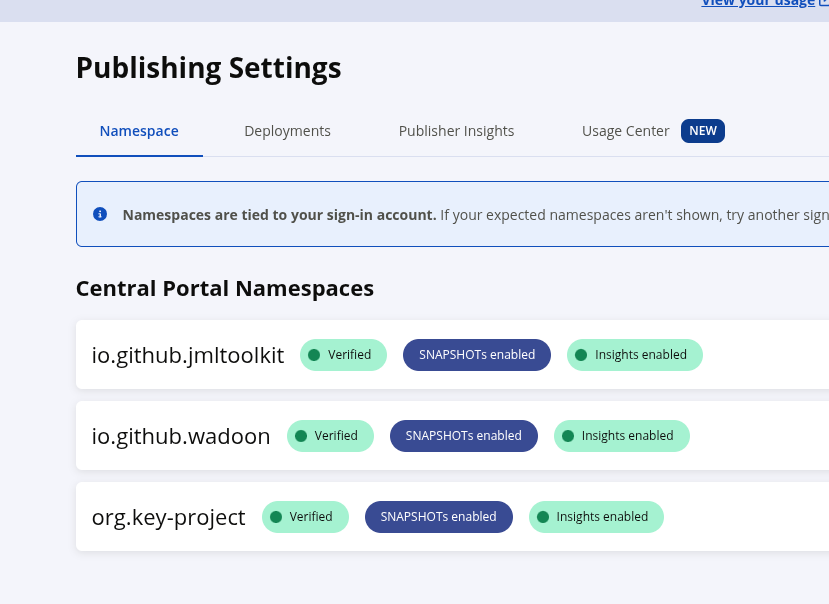
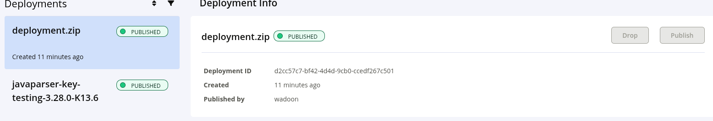

Maven Central is one important distribution of KeY. Multiple secondary projects depends on this, like `key-citool`, `key-rpc`. 
This text shortly described the necessary steps to deploy on this channel very manually. 


## Pre-requiresite 

1. Ensure you have access on `org.key-project` namespace. Access can be requested by the senior team member. 

    

2. [Ensure that you are familar with the rules on Maven Central](https://central.sonatype.org/pages/support/) and general process. 


3. Get app credentials (TOKEN + SECRET). 

## Deployment.

1. Ensure you are on the release branch. Clean-up!

   ```sh
   $ gradle clean
   $ rm -rf local
   ```

2. Freshly build KeY, and deploy into local repo. For this you need to setup GPG before hand.

   ```sh
   export ORG_GRADLE_PROJECT_signingInMemoryKeyPassword=<the keys password>
   export ORG_GRADLE_PROJECT_signingInMemoryKey=$(gpg --export-secret-keys --armor 0DB557D9253539E9D63F9F40FFD16124DA897262 gpg | tac | tail -n +3 | tac | tail -n +3 | tr -d '\n')

   gradle --parallel publishMavenPublicationToLOCALRepository
   ```

3. Pack the repo together correctly: 

   ```
   7z a deployment.zip -w local/.
   ```

   Resulting in currently 200MB.

4. Upload: 

    ```sh
    curl --user "${SONATYPE_API_TOKEN}:${SONATYPE_API_SECRET}" \
        -H 'Content-Type: multipart/form-data' \
        -F "bundle=@${BUNDLE_PATH};type=application/zip" \
        "${UPLOAD_ENDPOINT}?publishingType=USER_MANAGED"
    ```

5. In the background, the validation process starts. Login into [central](https://central.sonatype.org), and check the status. 
   You can publish, if there are no errors. 

   

6. Publication and indexing can take upto 30 minutes easily. 
