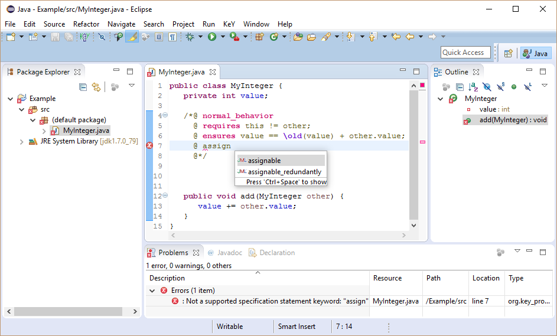

# JML Editing

JML Editing extends the [Java development tools
(JDT)](https://eclipse.org/jdt/) with support for
[JML](http://www.jmlspecs.org) to make writing JML specifications as
convenient as writing Java source code.

The following screenshot shows for instance the extended syntax
highlighting of the Java Editor:\

## Prerequisites

JML Editing is compatible with [Eclipse](http://www.eclipse.org) Luna
(4.4) or newer.

Required update-sites and installation instructions are available in the
[download](https://www.key-project.org/download/) area.

## Current Functionality

-   Syntax highlighting for JML specifications with configurable colors
-   Auto completion for JML keywords
-   Auto indentation of JML comments while writing
-   Code formatter preserves JML comments
-   Hovers for JML keywords
-   Support of JDT\'s Rename and Move Refactorings
-   Error marker for syntax violations
-   Profiles for different JML dialects
    -   Predefined profiles for JML standard and KeY
    -   Profiles are customizable (by the user)
    -   Additional profiles can be offered by developers via an Eclipse
        extension point
    -   Profiles are based on extendable and configurable JML parsers

## Future Work

-   Support for missing JML features
-   Auto completion within JML keyword content
-   Specifications shown in the Outline view
-   Refactorings of JML specifications
-   Links within JML specifications
-   Error marker for semantic failures
-   No spell checking of JML keywords
