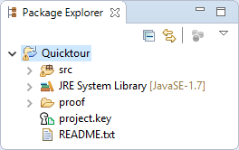
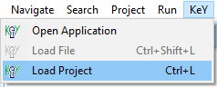

# MonKeY

MonKeY provides a batch verification of all proof obligations. This
means that the tool lists all proof obligations provided by the source
code and allows to prove them in a batch. Statistics such as the used
time or the complexity of proofs are also provided.

The following sections illustrate the main features of MonKeY using
screenshots. Each section contains numbered screenshots that explain a
usage scenario step by step. Clicking on each picture produces a more
detailed view. The screenshots may differ from the latest release.

## Prerequisites

MonKeY is compatible with [Eclipse](http://www.eclipse.org) Indigo (3.7)
or newer.

Required update-sites and installation instructions are available in the
[download](../../download/#eclipse) area.

## Verify all proof obligations of a project

1. Select project to load.

    

2. Select main menu item "KeY, Load Project".

    

3. Select Application "MonKeY".

    

4. Select "Start selected Proofs" and wait until all proofs are done.

    

5. Inspect the result.

    

## KeY basics in Eclipse and troubleshooting

-   [KeY basics in Eclipse (Cross-project
    Functionality)](../CrossProject/)
    -   [Create an example project](../CrossProject/#example)
    -   [Change taclet options](../CrossProject/#taclet)
    -   [Define class path used by
        KeY](../CrossProject/#KeYsClassPath)
-   [Troubleshooting](../CrossProject/#troubleshooting)
    -   [Unresolved classtype (support for API
        classes)](../CrossProject/#API)
