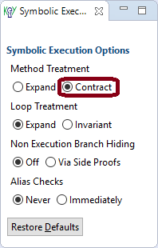
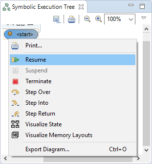
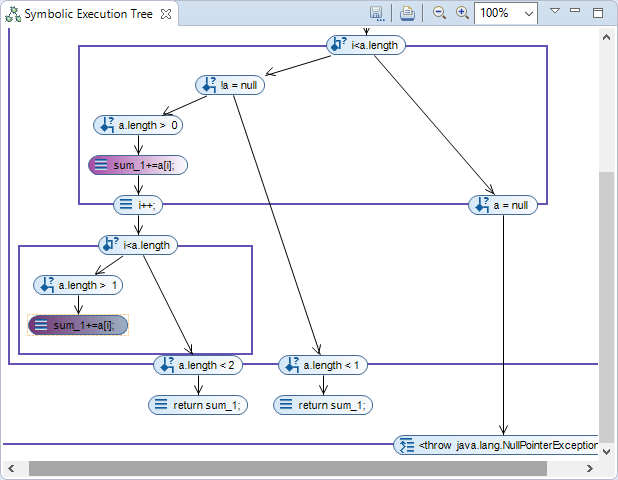
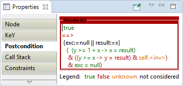
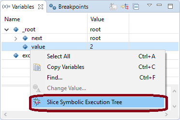
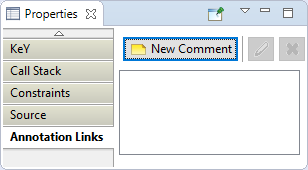
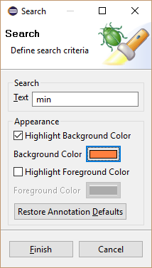

---
---

# Symbolic Execution Debugger

The Symbolic Execution Debugger (SED) is a platform for symbolic
execution in general and allows to interactively debug programs based
on symbolic execution. Symbolic execution discovers all possible
execution paths simultaneously. This is achieved by the use of
symbolic in lieu of concrete values resulting in a symbolic execution
tree. Each node in the symbolic execution tree provides the full state
and related information such as the symbolic call stack or the path
conditions under which the node is reached.

Execution can start at any method or at any statement without setting
up a context. Navigation is realized using classic debugger
functionality, including stepwise execution or breakpoints.

The screenshots of the following sections illustrate the main features
of SED using KeY as symbolic execution engine. Each section contains
numbered screenshots that explain a usage scenario step by step.
Clicking on each picture produces a more detailed view. The
screenshots may differ from the latest release. At the end of this
webpage we briefly describe the architecture of SED and the theory
behind it.

## Prerequisites

The Symbolic Execution Debugger is compatible with
[Eclipse](http://www.eclipse.org) Indigo (3.7) or newer.

Required update-sites and installation instructions are available in
the [download](../../download/#eclipse) area.

As getting started guide for new users we recommend the
[tutorial](tutorial.html) using the [SED examples](#example). In
addition, participation in the [evaluations](#evaluations) allows you
to try out the SED in a guided way by hand of different examples.

* Screencast: Symbolic Execution Debugger (SED)
* Screencast: Proof Attempt Inspection
* Screencast: Interactive Verification

## Debug any method or any statement(s) symbolically

1. Select the method or the statements to
debug.

     symbolically")
    
2. Launch selection via main menu item "Run, Debug As, Symbolic Execution Debugger".

     symbolically")

3. Switch to perspective Symbolic Debug.

     symbolically")

4.  Perform symbolic execution interactively.

     symbolically")
    
5. Inspect all possible execution paths.

     symbolically")

6. Inspect full state and related information of the selected node.

     symbolically")

7. Inspect constraints limiting the symbolic value of a variable.

     symbolically")

8. Source code reached during symbolic execution is highlighted and allows to jump to the corresponding node.

     symbolically")

### Collapse frames representing code blocks {: #grouping}

1. Select context menu item "Collapse" of a symbolic execution tree node which opens a
frame.

    

2. In the collapsed state only the conditions under which the end of the code block is reached are
shown.

    

### Limit execution paths by customizing the debug configuration {: #customization}

1. Edit debug configuration via main menu item "Run, Debug
Configurations\...".

    

2. Limit execution paths with a precondition or by a JML
specification.

    

3. Launch and debug as
above.

    

### Use loop invariants to guarantee finite symbolic execution trees in presence of loops {: #loopInvariants}

1. Set loop treatment to
"Invariant".

    

2. Launch and debug as above. The "Body Preserves Invariant" branch
represents an arbitarary loop iteration and ends when the loop body is completely executed. Branch "Use Case" continues execution after the
loop.

    

### Use method contracts if the implementation of a called method is not of interest {: #contracts}

1. Set method treatment to
"Contract".

    

2. Launch and debug as above. If normal as well as exceptional
behavior was specified in the method contract, symbolic execution will split
after applying the contract to cover both
possibilities.

    

### Visualize all possible memory layouts of a node {: #layouts}

1. Select "Visualize Memory
Layouts".

    

2. Switch to perspective "State
Visualization".

    

3. Inspect memory layouts caused by
aliasing.

    

### Use breakpoints to find executions resulting in a specified state {: #breakpoints}

1. Define a Line, Method or Java Exception breakpoint, a Watchpoint or a KeY Watchpoint as
usual.

    

2. Continue symbolic
execution.

    

3. Symbolic execution suspends when breakpoint is
hit.

    

4. Continue symbolic execution if
desired.

    

### Inspect any proof performed by KeY {: #proofAttempt}

1. Select the proof file to inspect and click on context menu item "Debug As, Symbolic Execution Debugger
(SED)".

    

2. Symbolic execution tree explored by the proof is shown in view "Symbolic Execution Tree".

    

### Verify a method contract {: #verifiyMethodContract}

1. Select "Use existing contract" in the debug configuration, use the "Browse" button to select one and click on
"Debug".

    

2. Explore the program behavior as
usual.

    

3. The source code is conform to the method contract if and only if all branches end in a termination node and no node in the full symbolic
execution tree is red crossed out.

    

### Trace truth values evaluated by KeY as part of a proof {: #traceTruthValues}

1. Enable "Truth Value Evaluation" in the debug configuration and launch it.

    

2. A red crossed out node offers a properties tab which shows the truth value tracing.

    

### Slice a symbolic execution tree {:#slicing}

1. Select context menu item "Slice Symbolic Execution Tree" of a variable in view Variables.

    
1. Configure Slicing Algorithm.

    
1. Symbolic execution tree nodes part of the slice are highlighted.

    

### Add comments to symbolic execution tree nodes {: #comments}

1. Select symbolic execution tree node and switch to properties tab "Annotation Links". Click then on "New Comment".
    

    
1. 2. Enter comment.

    
1. 3. Comment is shown in properties tab "Annotation Links".

    

### Search text in the labels of symbolic execution tree nodes {: #search}

1. Select debug target or launch in view Debug and switch to properties tab "Annotations". Click then on "Search".

    

2. Define search criteria.

    

3. Nodes part of the search are
highlighted.

    

4. Click on "Show annotation links" to list found
nodes.

    

### Create Java project with examples for the Symbolic Execution Debugger (Tutorial) {: #example}

1. Open example wizard via main menu item "File, New, Example\...".

    ")

2. Select "Symbolic Execution Debugger (SED), SED Examples".

    ")

3. Enter the project name.

    ")

4. Have a look at the created example content.

    ")

### Configuration of KeY's symbolic execution engine and troubleshooting {: #troubleshooting}

- [KeY basics in Eclipse (Cross-project Functionality)](../CrossProject/)
    - [Create an example project](../CrossProject/#example)
    - [Change taclet options](../CrossProject/#taclet)
    - [Define class path used by
        KeY](../CrossProject/#KeYsClassPath)
- [Troubleshooting](../CrossProject/#troubleshooting)
    - [Unresolved classtype (support for API
        classes)](../CrossProject/#API)

### Experimental Evaluations {: #evaluations}

The following evaluations were performed to evaluate different use
cases of the Symbolic Execution Debugger (SED). **Participation is
still recommended as starting point for new users.** Each evaluation
explains the use of the SED and allows you to try it out on different
examples.

-   [Reviewing Code Evaluation](ReviewingCode.html)
-   [Understanding Proof Attempts Evaluation](UnderstandingProofAttempts.html)

### Architecture {: #architecture}

The Symbolic Execution Debugger (SED) extends
[Eclipse](http://www.eclipse.org) and can be added to existing
Eclipse-based products. In particular, SED is compatible with the
[Java Development Tools (JDT)](http://www.eclipse.org/jdt) that
provide the functionality to develop Java applications in Eclipse. To
achieve this and also a user interface that seamlessly integrates with
Eclipse, SED consequently uses and extends the Eclipse platform as
shown by the following graphic:

<table border="0" cellspacing="10" cellpadding="20">
  <tr>
    <td></td>
    <td colspan="2" bgcolor="#b1d3ec" align="center">KeY Debug Core</td>
    <td colspan="2" bgcolor="#b1d3ec" align="center">KeY Debug UI</td>
    <td></td>
  </tr>
  <tr>
    <td></td>
    <td></td>
    <td rowspan="2" bgcolor="#b1d3ec" align="center">Symbolic Debug Core</td>
    <td bgcolor="#b1d3ec" align="center">Visualization UI</td>
    <td></td>
    <td></td>
  </tr>
  <tr>
    <td></td>
    <td></td>
    <td bgcolor="#b1d3ec" align="center">Symbolic Debug UI</td>
    <td></td>
    <td></td>
  </tr>
  <tr>
    <td colspan="2" bgcolor="#4e9ad6" align="center">JDT Core/Debug</td>
    <td bgcolor="#4e9ad6" align="center">Debug Core</td>
    <td bgcolor="#4e9ad6" align="center">Debug UI</td>
    <td colspan="2" bgcolor="#4e9ad6" align="center">JDT UI</td>
  </tr>
  <tr>
    <td colspan="3" bgcolor="#4e9ad6" align="center" width="50%">Workspace</td>
    <td colspan="3" bgcolor="#4e9ad6" align="center" width="50%">Workbench</td>
  </tr>
</table>

The core of Eclipse is the *Workspace* managing projects and the user
interface (*Workbench*) with editors, views and perspectives. Based on
this, provides the [Debug
Platform](http://www.eclipse.org/eclipse/debug) language independent
facilities for debugging (*Debug Core* and *Debug UI*). Finally, JDT
offers functionality to edit and debug Java programs (*JDT Core/Debug*
and *JDT UI*).

*Symbolic Debug Core* extends the debug model of the Debug Platform for
symbolic execution in general independent from languages and symbolic
execution engines. Additional UI extensions (*Symbolic Debug UI*) and
visualization capabilities (*Visualization UI*) are also available.

At last, *KeY Debug Core* implements the extended debug model for
symbolic execution based on [KeY\'s symbolic execution engine](#SEE).
The required extensions to the user interface to launch Java methods and
statements symbolically are provided by *KeY Debug UI*.

The SED platform allows to integrate different symbolic execution
engines with purpose of debugging, program understanding or to control
analysis based on symbolic execution. All to be done is to realize the
[extended debug model for symbolic execution](#ExtendedDebugModel) and
to offer user interface extensions to start symbolic execution. An
example implementation showing how to integrate a symbolic execution
engine into the Symbolic Execution Debugger, can be found
[here](example.zip).

### The extended debug model for symbolic execution {: #ExtendedDebugModel}

The Eclipse [Debug Platform](http://www.eclipse.org/eclipse/debug)
provides language independent facilities for debugging. This is achieved
by a language independent debug model which is implemented for different
languages like Java. Once a program is launched, it is represented as
`ILaunch` and provides access to the debuggable execution context. The
debuggable execution context is defined by `IDebugTarget` instances and
allows for instance to list the currently running threads (`IThread`).
For more details about the Debug Platform we refer to the article [How
to write an Eclipse
debugger](http://www.eclipse.org/articles/Article-Debugger/how-to.html).

The debug model reflects the structure of running programs and is not
designed for symbolic execution by default. But it can be reused and
extended for symbolic execution as the following image shows:

If something is launched symbolically (`ILaunch`), the debuggable
execution context is defined by `ISEDDebugTarget` instances which is a
subtype of `IDebugTarget`. It provides access to the root of a symbolic
execution tree represented as `ISEDThread` instance. All nodes within a
symbolic execution tree are subtypes of `ISEDDebugNode` that allows to
access child nodes and the parent node. Beside the start node
(`ISEDThread`) represent `ISEDStatement`, `ISEDBranchStatement`,
`ISEDLoopStatement` and `ISEDLoopCondition` different kinds of
statements. A method call treated by inlining is reprehend by an
`ISEDMethodCall` and the return of the called method by
`ISEDMethodReturn` or `ISEDExceptionalMethodReturn` instances.
Alternatively, method calls can be treated by applying contracts
(`ISEDMethodContract`) and loops by applying a loop invariant
(`ISEDLoopInvariant`) instead of unrolling it. If execution splits into
several branches `ISEDBranchCondition` nodes show the condition under
which each path is taken. Finally, symbolic execution terminates
normally (`ISEDTermination`) or exceptionally with an uncaught exception
(`ISEDExceptionalTermination`). Branches executing only the loop body
after an applied loop invariant end usually in an
`ISEDLoopBodyTermination` node as long as the loop does not terminate
abnormally.

### KeY's Symbolic Execution Engine {: #SEE}

A general purpose symbolic execution engine based on KeY is developed
together with the Symbolic Execution Debugger. It uses only Java
functionality and can be used outside of an Eclipse setup.

KeY is a semi-automatic verification tool that proves the correctness of
sequential Java programs (without garbage collection, dynamic class
loading and floats) annotated with [JML](http://www.jmlspecs.org)
specifications. Within a proof, symbolic execution is mixed with the
evaluation of logical formulas. KeY operates on the source code level
and thus a static symbolic execution is performed meaning that the
program is never actually executed.

KeY\'s Symbolic Execution Engine constructs a proof and extracts the
symbolic execution tree from it. The main difference to verification is
that no specifications are needed at all. But if they are available,
they can be used during symbolic execution. Loop invariants ensure
finite proof trees in presence of loops. Method contracts allow to treat
methods for which the source code is not available and guarantee finite
proof trees in presence of recursive method calls.

A specific proof strategy ensures that the proofs from which the
symbolic execution tree is extracted have a suitable shape. That
strategy also guarantees that symbolic execution is done in the correct
order of Java semantics.

The symbolic execution engine as such is fully automatic. In rare cases
side proofs of logical formulas (e.g., the fulfillment of pre- and
postconditions) may remain open if the strategy is not powerful enough
to discharge them.
