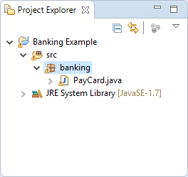
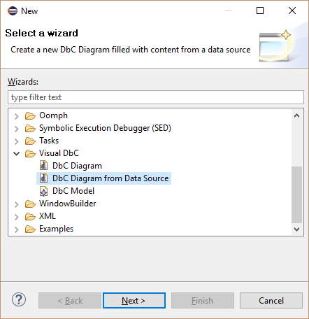
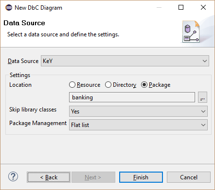
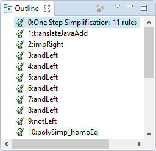
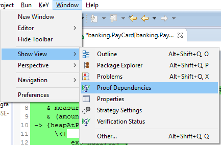

# Visual DbC

Visual DbC is a proof management and visualization tool. It allows to
visualize code members (e.g. types, attributes, methods) together with
specifications (e.g. method contracts, invariants) and proofs in a DbC
diagram similar to an UML class diagram. Proof references are used to
indicate that a code member or a specification is used by a proof.

The following sections illustrate the main features of Visual DbC using
screenshots. Each section contains numbered screenshots that explain a
usage scenario step by step. Clicking on each picture produces a more
detailed view. The screenshots may differ from the latest release.

## Prerequisites

Visual DbC is compatible with [Eclipse](http://www.eclipse.org) Indigo
(3.7) or newer.

Required update-sites and installation instructions are available in the
[download](../../download/index.html#eclipse) area.

## Visualize existing source code

1. Select package to visualize its source code. Subpackages will be automatically
included.

    

2. Open new wizard via context menu item "New, Other\..." of the
selected
package.

    

3. Select "Visual DbC, DbC Diagram from Data
Source".

    

4. Define the file name of the diagram file. This file contains the graphical
representations.

    

5. Define the file name of the model file. This file contains the
content.

    

6. Optionally change the package treatment and finish the
wizard.

    

7. Inspect the generated diagram. The layout of selected diagram elements can be improved by selecting
main menu item "Diagram, Arrange,
All".

    

## Do proofs with a DbC diagram

1. Add a proof and name it
"ContractPO".

    

2. Add a proof target reference from the proof to the element to
verify.

    

3. Select "Open Proof" in the context menu of the
proof.

    

4. Do the proof as normal in the user interface of
KeY.

    

5. Detected proof references are automatically added to the diagram.

    

6. View "Statistic" shows the status of all proof
obligations.

    

## Visualize proof dependencies of a proof in the KeYIDE

1. Do the proof in the [KeYIDE](KeYIDE.html) as normal.

    

2. Open view "Proof Dependencies" via main menu item "Window, Show
View, Proof Dependencies".

    

3. Inspect the used code members and specifications in view "Proof
Dependencies".

    

## KeY basics in Eclipse and troubleshooting

-   [KeY basics in Eclipse (Cross-project
    Functionality)](../CrossProject/index.html)
    -   [Create an example project](../CrossProject/index.html#example)
    -   [Change taclet options](../CrossProject/index.html#taclet)
    -   [Define class path used by
        KeY](../CrossProject/index.html#KeYsClassPath)
-   [Troubleshooting](../CrossProject/index.html#troubleshooting)
    -   [Unresolved classtype (support for API
        classes)](../CrossProject/index.html#API)
