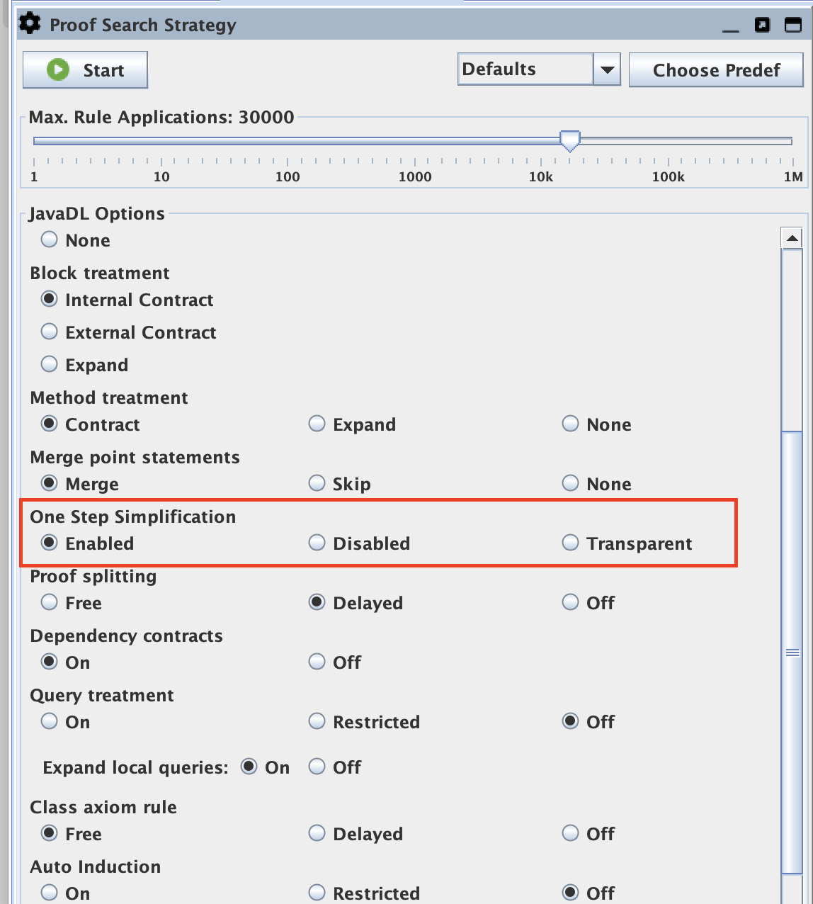
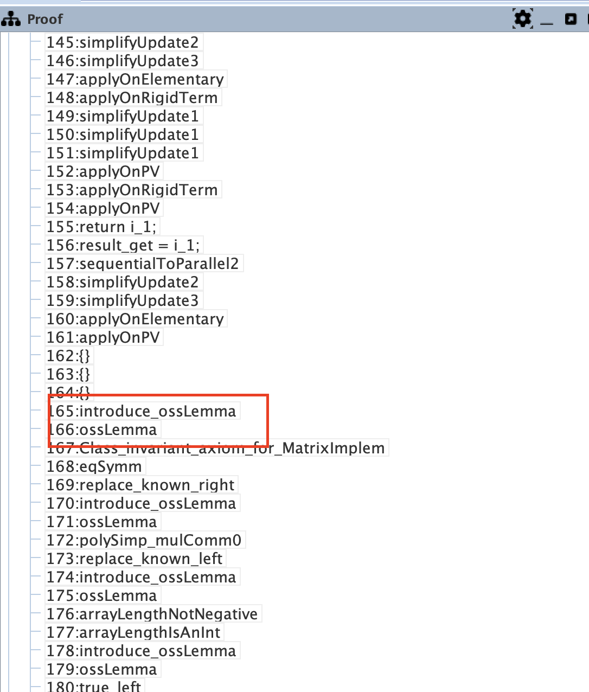
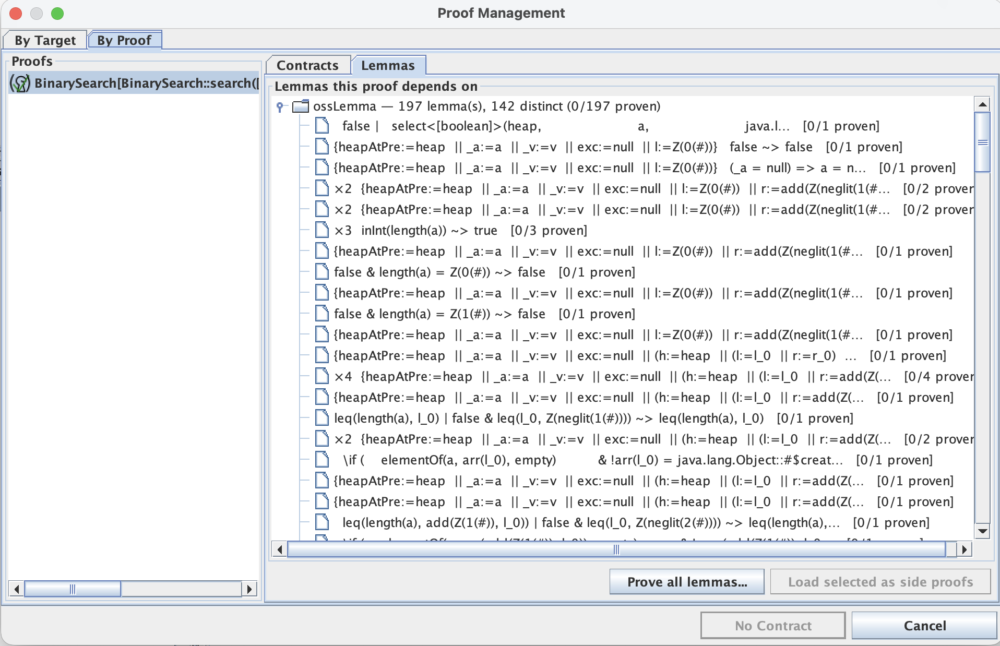
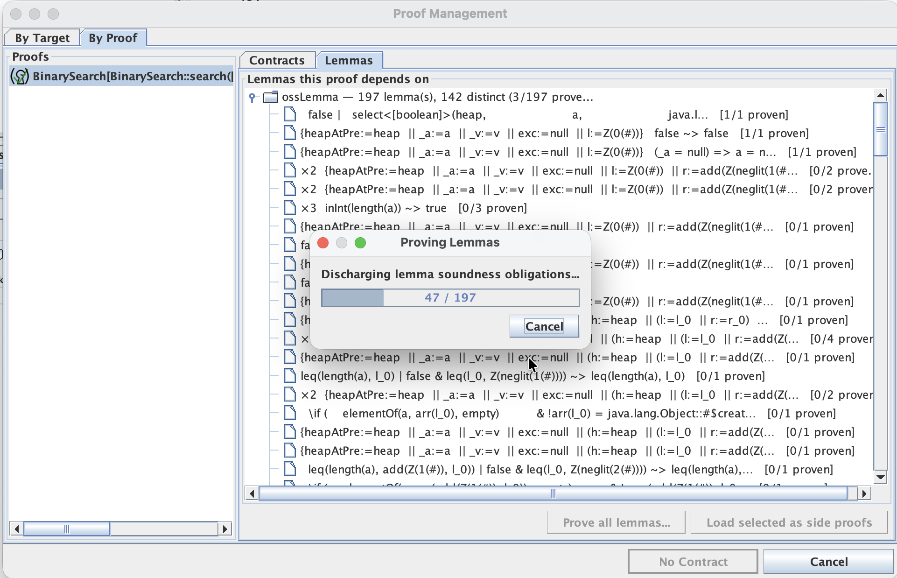

# KEP-1: Taclet-Generating Transformers

!!! note "Status: proposal / proof-of-concept"

    This KEP describes an **experimental** feature that currently lives on a
    branch and in an open pull request. The design is settled enough to try
    out, but details may still change, and the feature may be reshaped before
    (or instead of) being merged.

    - **Pull request:** _to be linked_ (`KeYProject/key` — "RFC: Taclet-generating transformers")
    - **Scope of this page:** the concept, how to use it from the GUI and the
      command line, and where the idea goes beyond the One Step Simplifier.

## The idea

Several parts of KeY perform *many* calculus steps at once in Java code:
**term transformers** (metaconstructs such as `#add`, which computes an
integer sum during rule application) and **built-in rules** — the
**One Step Simplifier** (OSS) above all, which aggregates a whole fixpoint of
rewrite steps into a single proof node. While OSS shows you a protocol as certificate
what it has done, the protocol cannot be easily used to derive an OSS free proof. This means,
you have to trust a second rewrite engine to be correct. Meta constructs, program transformers and
other built-in rules do not provide any transparency and one has to trust the implemented Java code.
The big advanatage of these constructs is speed and the ability to express complex transformations.

This KEP explores a middle path. Instead of a transformer that mutates the
proof directly, a **lemma generator** produces a *specialized, metaconstruct-free
taclet* that captures the transformation at a concrete position. That taclet is

- **introduced** as a goal-local rule — a recorded proof step — and then
- **applied** as an ordinary, fully recorded taclet application, and
- **provable**: a soundness proof obligation is created for it and can be
  discharged like any other proof, in the base calculus.

The performed transformation becomes an inspectable, separately certifiable
artifact, while proof search still runs at full speed where you want it to.

### Two proof steps instead of one opaque step

Consider the propositional tautology

```
p & true & (q | true) -> true & p
```

With the One Step Simplifier **enabled** (the default), automatic proof search
closes it in one aggregated step:

```
0: One Step Simplification
  1: closeTrue
```

The `One Step Simplification` node hides five individual rewrites. The proof
file records only the position; on reload, OSS re-runs the whole fixpoint and
trusts that the current rule base reproduces the same result.

With One Step Simplification set to **Transparent**, the same proof instead
introduces and applies a generated lemma:

```
0: introduce_ossLemma
  1: ossLemma_fbf1a98ed8f4__0
    2: closeTrue
```

The introduced taclet is exactly the aggregated simplification, spelled out:

```
ossLemma_fbf1a98ed8f4__0 {
    \find( p & true & (q | true) -> true & p )
    \replacewith( true )
}
// aggregates 5 base-calculus steps
```

`introduce_ossLemma` is a built-in rule that only makes the taclet available
(the sequent is unchanged); the next node is an ordinary application of that
taclet. Both are recorded, so the proof replays without re-running the
simplifier, and the lemma can be proved sound on its own.

*(Reproduce the trees above by loading the problem with One Step Simplification
set to `Enabled` and to `Transparent` respectively, and running the automatic
strategy.)*

### The framework

The mechanism is generator-agnostic. A `LemmaTacletGenerator` maps a position
in a goal to a taclet, subject to three contract requirements:

- **Context-freeness.** Any branch-local hypotheses the transformation relies
  on must be made explicit as `\assumes` clauses, so the taclet is globally
  sound and its obligation can be proved in the empty context.
- **Provability.** The taclet must lie in the fragment the taclet soundness
  proof-obligation machinery supports — no variable conditions, no
  metaconstructs, no modalities.
- **Determinism.** Replaying the introducing step must regenerate an identical
  taclet, in particular the identical name.

The first generator is `OssLemmaGenerator`, which turns an aggregated
one-step-simplification `F ↝ F'` into a taclet. 
Not all OSS steps are supported (yet) as all generated taclets should be provable using 
KeYs Taclet PO generator.

A generated lemma's soundness obligation is created **lazily** (proof search
never pays for it) and proved with the One Step Simplifier switched **off**. 
This ensures that rules are proven correct with the taclet proof engine. Otherwise,
one would rpoof OSS with itself as it used behing the scenes by the OSS lemma generator
to produce the replacewith formula of the taclet.

## Using it in the GUI

### 1. Choose the transparent mode

`Proof Search Strategy` → **One Step Simplification** now offers a third value
besides *Enabled* and *Disabled*: **Transparent**.



- **Enabled** — the classic opaque One Step Simplifier (fastest, least
  transparent).
- **Disabled** — no OSS at all; every simplification is an individual rule
  application (most transparent, largest proofs).
- **Transparent** — aggregated simplifications of modality-free formulas are
  performed via generated lemmas (inspectable *and* certifiable); formulas with
  modal operators are simplified by the ordinary calculus in individual steps.
  Proofs are fully transparent — they contain no opaque OSS step at all — but
  larger, and search is somewhat slower.

Run the automatic strategy as usual. The proof tree now shows
`introduce_ossLemma` / `ossLemma_…` pairs instead of `One Step Simplification`
nodes; clicking a generated taclet shows its full `\find` / `\replacewith`.



### 2. See and prove the lemmas a proof depends on

A proof that used generated lemmas is *closed only modulo* those lemmas until
their soundness obligations are discharged — its status is
**closed but lemmas left**. To inspect and discharge them, open
**Proof Management** (the proof-obligation browser), select the proof under
**By Proof**, and switch to the new **Lemmas** tab.



The lemmas are grouped **by generator** and, within a generator, collapsed
**by content**, so that the many introduction-point-distinct instances of the
same simplification appear as one row with a count and a proven/open status.
(On a real proof this matters: verifying `BinarySearch` in transparent mode
generates on the order of two hundred lemmas that collapse to a few dozen
distinct simplifications.)

From here you can

- **Load selected as side proofs** — bring the selected lemmas' obligations
  into the task tree as ordinary proofs to work on them interactively, or
- **Prove all lemmas…** — batch-discharge every obligation with an automatic
  step bound (obligations that do not close within the bound stay open for
  manual work), optionally saving each obligation proof to a directory.



Batch proving shows a progress dialog with a cancel button. Obligations that
close are certificates and are **not** added to the task tree (so a batch over
many lemmas does not flood it); only obligations that remain open are surfaced
for manual completion. Once all obligations are discharged, the proof's status
turns from *closed but lemmas left* to **closed**.

!!! tip "Cleaning up bulk-loaded side proofs"

    If you load many lemmas as side proofs, you can drop them all at once:
    right-click the **environment** node in the *Loaded Proofs* tree and choose
    **Abandon All Proofs of Environment**.

## Saving a transparent proof

Two entry points produce a proof in which OSS aggregations are elaborated into
generated lemmas:

- **GUI** — `File → Save Transparent Proof…`, also available from the
  task-list context menu and from the proof-closed statistics dialog. A proof
  found with the fast opaque simplifier is elaborated onto a fresh proof in
  which every eligible OSS step is replaced by an introduce/apply lemma pair,
  and that proof is saved. The original proof is untouched.
- **Command line** — `--save-transparent` writes `<file>.transparent.proof`
  next to the ordinary batch-mode output.

Loading a transparent proof replays the recorded introduce/apply pairs. The
generated taclets are **not** yet stored in the proof file; replay regenerates
them from the recorded step (their content-derived names make this
deterministic). Serializing the taclets into the file — so that a checker needs
only the taclet text and its obligation, with the generator out of the trusted
base — is a natural next step, deliberately out of scope for this proposal.

## Beyond the One Step Simplifier

The One Step Simplifier is the first and most rewarding generator, but the
framework is not tied to it.

- **Other term transformers and rewrite-shaped built-in rules.** Any
  transformation that produces a ground, modality-free rewrite `t ↝ t'` can be
  packaged the same way. The proof-of-concept includes a deliberately tiny
  generator for integer-literal addition (the `#add` metaconstruct analogue),
  used only to validate the framework end to end.

- **A posteriori elaboration.** The same generators drive a second mode: find a
  proof with the fast opaque rules, then *elaborate* the finished proof into a
  transparent one (this is what "Save Transparent Proof" does). Search stays
  fast; transparency is produced on demand afterwards.

- **Certification and reuse.** Because a generated lemma is a real taclet with a
  real soundness proof, the same simplification recurring across branches can in
  principle be captured once and reused — a first step towards a library of
  proven, proof-derived lemmas. Serializing generated taclets into proof files,
  and sharing them across proofs, are the obvious follow-ups.

- **Program transformers stay justified-by-construction.** Transformations whose
  result contains modalities (for example inserting a jump or otherwise
  rewriting a program) fall outside the provable-taclet fragment; for those the
  opaque, justified-by-construction path remains, and this KEP does not change
  them.

## Notes and limitations

- Transparent mode is explicitly a *pay-for-inspectability* mode: the
  symbolic-execution and update-simplification parts of a proof run at
  roughly the "OSS off" cost, while the FOL/heap bulk is still aggregated into
  lemmas.
- The soundness-obligation *fragment* for taclets is what bounds applicability: modality-free
  find formula (including update-laden ones) are lemma-eligible; find formulas containing
  program modalities are not.
  