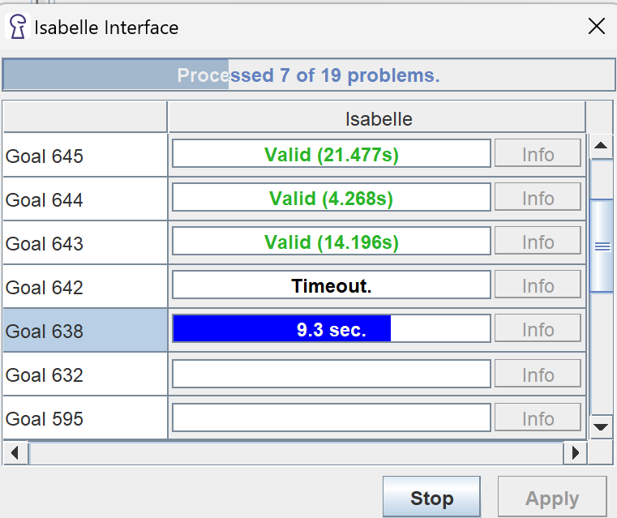

# Isabelle Translation

-- *Author: Nils Buchholz*, February 2025 valid for a future release of KeY based on KeY 2.12.3

!!! abstract

   This note describes the new *Isabelle Translation* extension in KeY 2.12.3
   When enabled it can be used to translate sequents to Isabelle and automatically search for proofs using Isabelle

## Overview

The Isabelle Translation plugin provides automated translation of KeY sequents to Isabelle/HOL. It also allows for automated proof search using Isabelle on these translations. 
The Isabelle translation can be used on any update-free sequent. Further details on the intricacies of the translation can be found under [https://doi.org/10.5445/IR/1000176239](https://doi.org/10.5445/IR/1000176239).
Thus it is necessary to first remove these from the sequent. This can be done automatically via the SMT Preparation macro in most cases.
The translation is accessible through the context menu of the whole sequent, which can be opened by right-clicking the sequent arrow. There are two options in this menu. 

`Translate to Isabelle`

   >This option translates only the currently selected goal and starts the automated proof search in Isabelle.

`Translate all goals to Isabelle`

   >This option translates all open goals in the currently selected proof and starts automated proof searches for them.

The proof search is currently conducted using "Isabelle sledgehammer", which calls a variety of SMT solvers and ATP provers to conduct its searches. More information about sledgehammer can be found at https://isabelle.in.tum.de/dist/doc/sledgehammer.pdf.

## Interface
Using the translation opens an interface. This interface will display the status of the Isabelle launch and the individual proof search progress for all translated goals.
The current status is shown in a bar at the top of the interface. This will at first show that the Isabelle is preparing to signify the starting of Isabelle and the creation of the preamble session files. When first starting Isabelle or changing the translation directory this may take up to a few minutes. Afterwards it will display the number of processed goals.
From this interface the proof search can be aborted using the Stop button. After proof sarch completes for all goals the results can be discarded, which closes the interface or applied, which automatically closes the relevant goals with custom rules containing the result of the respective sledgehammer calls.

<figure markdown>
   
   <figcaption>Isabelle Interface during proof search</figcaption>
</figure>

## Setup
The Isabelle Translation can be enabled like all other KeY plugins.
To use the automatic proof search parts of the Isabelle Translation, an Isabelle installation is required. In the plugin settings the path to the Isabelle directory can be configured. The path set here should point to the folder containing the Isabelle executable.

## Settings

Currently the Isabelle Translation provides two settings. These are found under Options>Settings>Isabelle Translation.

`Location for translation files`
   >This setting determines where the translation files should be stored. This includes the session files as well as the Isabelle theories for the preamble and the sequent translation.

`Isabelle installation folder`
   >This setting sets the folder of the Isabelle installation, as described in the Setup section.

`Timeout`
   >This setting sets the timeout for proof searches in seconds.

There is an additional button to check if a given version of Isabelle is supported. Currently the supported versions are Isabelle2023 and Isabelle2024-RC1.