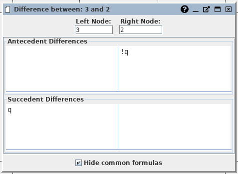

# Node Differences

-- *Author: Alexander Weigl, 24.07.2019*

In the context menu of the Proof Tree, you can the action *Diff with parent*,
which triggers a view for visualising the differences between Proof Nodes.

## View

The view shows the *serialNr* of selected nodes in the top, and the differences
between the antecedents and succedents seperately.

The differences for ante- and succedents are calculated in the same fashion:

1. We consider the ante- and succedents as a set of formulas, therefor formula order doesn't matter.
2. Given two formulae sets (left and right side) we calculate between each pair the Levensthein degree.
3. We greedy match the formulae from the left to right side. Starting with exact matches (zero differences) and ending with completely different pairs. 

The view shows each matched pair side by side.

## Action and Settings

You can:

* **change the serialNr** and this also changes underlying Proof Node for the
  corresponding side. You need commit your edit with enter.
  
* **toggle *Hide common formulas***, which enables or disables the presentation
of pairs without differences.

