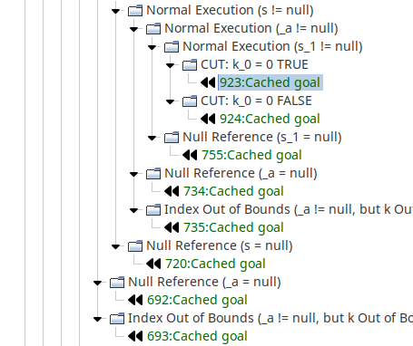
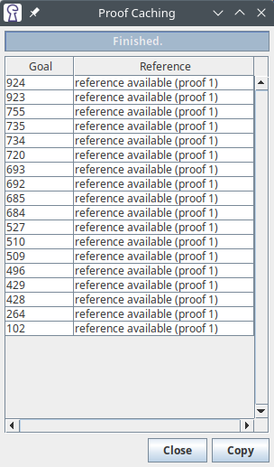

# Proof Caching

-- *Author: Arne Keller*, June 2023 valid for KeY-2.12.0

!!! abstract

    This note describes the new *Proof Caching* functionality in KeY 2.12.
    It allows reusing parts of earlier proofs when performing another proof.
   

## Overview

The *Proof Caching* functionality allows reusing previous proofs when creating a new proof.
More precisely, it allows you to close a branch of the proof by "reference" to an already closed branch in another proof.

## Required conditions for caching to work

To close a branch with sequent S in proof P using another branch with sequent S' in proof P', the following conditions have to bet:

1. Taclet options (handling of integer overflows etc.) of P and P' need to be equal
2. Antecedent(S') ⊆ Antecedent(S) and Succedent(S') ⊆ Succedent(S)
3. Neither branch uses state merging
4. S' may not contain query terms
5. S' may not contain modalities
6. All proof rules used in the branch starting at S' must be available in proof P at sequent S (or derived in the same way)

Condition 4 and 5 are required because the definition of method frames depends on the Java source code currently loaded,
which is not checked when searching.
It is also unlikely that the user will attempt to prove the exact same method twice.
Condition 3 is required because state merging is always spread over multiple branches.
The caching functionality only works on a single branch.
Condition 2 works because any extra formulas can be hidden from the sequent.
Without condition 1, the replay may fail.

## Activating the extension

In KeY's settings dialog, enable the Proof Caching extension.
You can toggle the automatic search for references in the "Proof Caching" section (on by default).

## Automated reference search

When running the auto pilot or a strategy macro, KeY will automatically search for references
whenever the proof is branched.
This search considers all closed branches in other proofs and compares the current sequent to the
first node in the closed branch.
See above for the checked conditions.

## Manual reference search

Right-click on an open goal in the proof tree and select "close by reference".
If a matching branch is found, the goal will be closed.
Otherwise, a dialog with an error message will open.

## Copying referenced proof steps

In the status line, a button indicates whether cached goals are present:

Clicking on the button opens a dialog with additional details where the referenced proof
may be copied into the new proof.
The referenced proof steps will also be copied automatically when saving the proof.

## Saving the full proof

When saving a proof that references other proofs, those proof steps are first copied into the new proof.
This ensures that the proof is reloadable and self-contained.
When a referenced proof is closed, the proof steps required in other proofs are first copied over.
This behaviour is configurable in the settings.
Instead of copying the closed proof, the new proof can also be reopened.

## Possible future extensions

Not implemented yet.

- checking for references right after finishing symbolic execution: so far, only if the proof is split afterwards
- allowing for "compatible" differences in choice settings (difficult, as some steps may need to adapted/skipped)

### Saving cache information across KeY runs

So far, only currently opened proofs are considered.
The database would need to contain:

- the proof and associated Java files
- for each closed branch: sequents in text form
- and more...