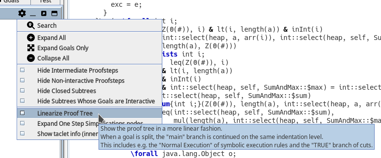
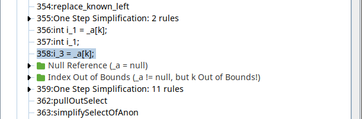
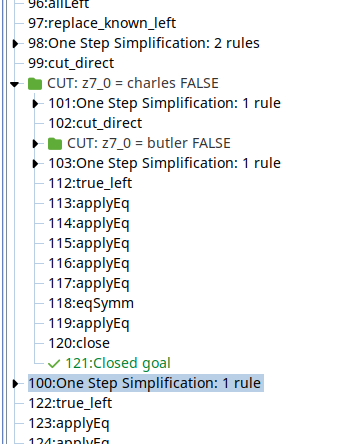

# Proof Tree: linearized symbolic execution

In the proof tree settings, you can enable the "Linearize Proof Tree" option.

## Effect when enabled

For symbolic execution steps, the "Normal Execution" branch will (visually) continue on the parent branch. See the screenshot below for a quick example.
The exceptional case branches (e.g. Null Reference, Index Out of Bounds) are therefore placed above the steps of the Normal Execution branch.

Additionally, the TRUE branch of cut_direct applications will visually continue on the parent branch.
This mechanism may be extended further by other taclets tagging their "main" created branch.

