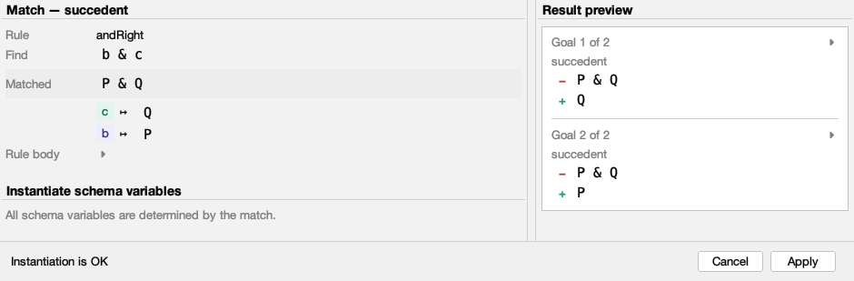
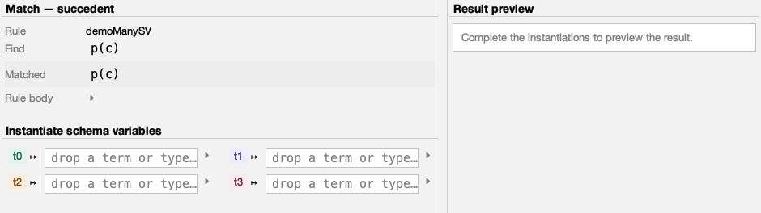
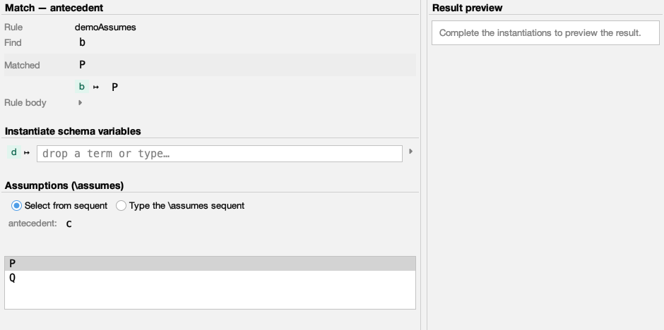
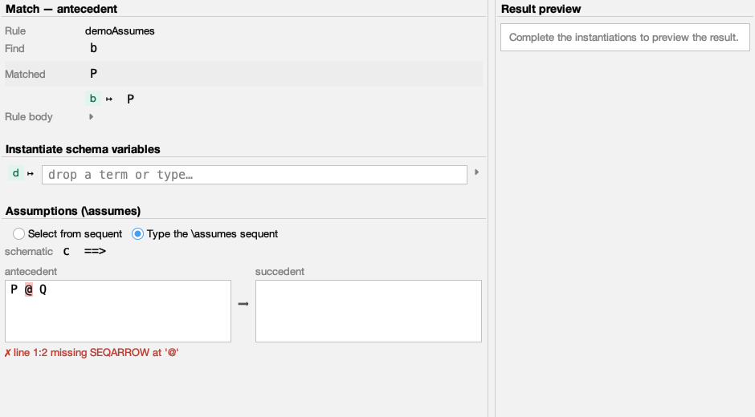
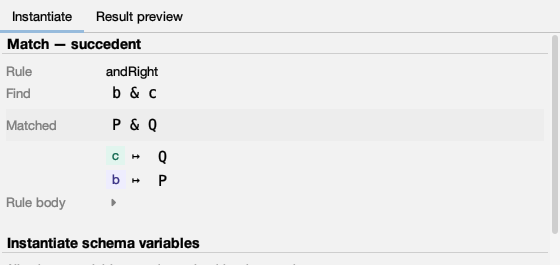
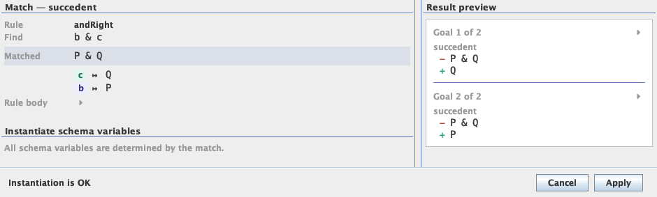

# The Taclet Match Dialog

!!! warning "Unreleased / experimental page"
    This page documents a redesigned dialog proposed in an open pull request and
    **not yet part of a KeY release**. It is kept out of the site navigation
    until the change is accepted; details and screenshots may still change.

When KeY needs your help to apply a rule — a quantifier instantiation, a cut, a
rule with an `\assumes` clause — it opens this dialog so you can supply the
missing pieces. It shows how the rule matched your sequent and what applying it
would do, all in one place.

## How the rule matched

The top-left **match overview** answers the first question you usually have:
*how did this rule match here?*

* **Find** is the rule's schematic pattern; **Matched** is the actual term it
  landed on, set off in a faint band so the concrete instance stands out.
* Each schema variable the match has already fixed appears as a coloured chip
  next to the term it stands for (here `b ↦ P`, `c ↦ Q`). A variable keeps its
  colour everywhere in the dialog, so it is easy to follow.
* The full rule body is one click away under **Rule body**, and otherwise stays
  out of the way.

On the right, the **result preview** shows what you would get if you applied the
rule right now — removed formulas in red (`−`), added ones in green (`+`),
grouped per resulting goal. It refreshes by itself a moment after you change
something, and it is only ever a preview: your proof stays untouched until you
press **Apply**.

## Filling in schema variables

You only ever see the variables that still need your input. The ones the match
already settled stay read-only in the overview above.

* Type a term, or **drag one straight from the sequent** and drop it on the
  field — it lands where your cursor is.
* A long or multi-line value expands on a small toggle instead of stretching the
  window.
* With several variables the fields tidy themselves into two columns.

## Supplying the assumptions

When a taclet has an `\assumes` clause, its instantiation gets its own section,
and you can choose how to fill it in.

=== "Pick from the sequent"

    For each assumption, choose a matching formula from a short candidate list.
    Selecting one commits it straight away, and the preview follows.

    

=== "Type it yourself"

    Prefer to write it out? Type the whole `\assumes` sequent, with a schematic
    reminder of what is expected right above.

    

    What you type is read as you go and checked for shape, formula count and
    compatibility with the match. A syntax slip is reported in plain words and
    **pointed at right where it happens**, so you are never left hunting.

## Mistakes caught early

Whatever you enter is checked as you go, so a problem shows up while you are
still typing — not after you press **Apply**.

* A typed `\assumes` sequent is parsed as you type; a slip is reported in plain
  words and the **offending spot is highlighted** (here the stray `@`).
* The status line tracks the whole instantiation — it reads *Instantiation is OK*
  only when everything fits, and otherwise tells you what is still missing or why
  the rule does not apply, before you commit.

## Comfortable in any theme

Inputs sit beside the preview when there is room and fold into tabs when there is
not; the dialog uses the active look-and-feel throughout, classic or flat.

{ width="320" }

Drag the divider to balance the inputs against the preview. Below a threshold
width the two sides fold into **Instantiate** and **Result preview** tabs. The
window remembers its size and place for next time.

---

*Coming next: highlighting each schema variable in its own colour inside the
matched term, so you can see at a glance which part is which.*
