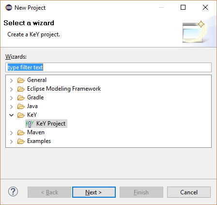
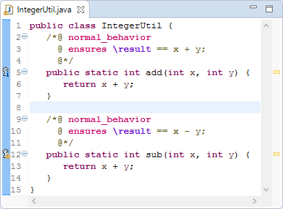
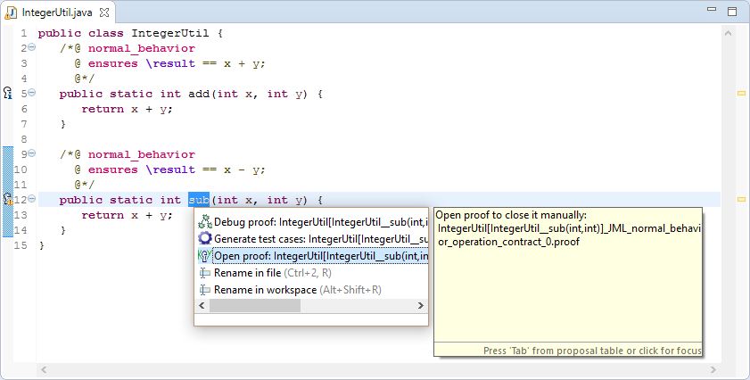
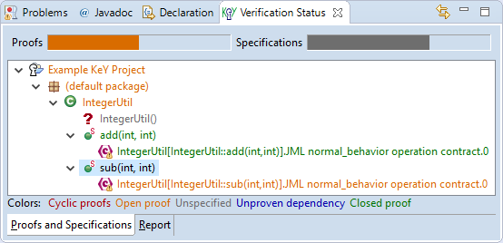
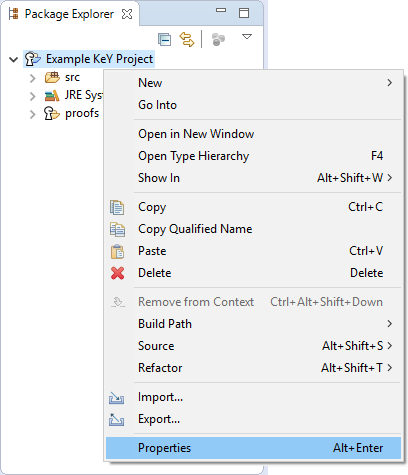
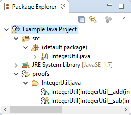

# KeY Resources

KeY Resources provides the "KeY project" with automatic background
proofs. Such projects extends the functionality of a Java project by
maintaining automatically proofs in background. This means that the
tool tries to do proofs automatically whenever files in a project
change. Markers are used to show the proof result directly in the
source editor.

The following sections illustrate the main features of KeY Resources
using screenshots. Each section contains numbered screenshots that
explain a usage scenario step by step. Clicking on each picture produces
a more detailed view. The screenshots may differ from the latest
release.

## Prerequisites

KeY Resources is compatible with [Eclipse](http://www.eclipse.org)
Indigo (3.7) or newer.

Required update-sites and installation instructions are available in the
[download](../../download/index.html#eclipse) area.

## Create a KeY Project

1. Open new project wizard via Package Explorer context menu item
"New, Project\...".

      

2. Select "KeY Project".

      

3. Define project name and finish the wizard.

    

## Work with a KeY Project

1. Edit source code as normal and save it.

    

2. During build proofs are automatically executed\
and results are shown via marker.

    

3. Proofs are automatically\ maintained in folder "proofs".

    

4. Tooltip of a marker explains the proof state and give hints how to
continue.

    

5. Proof files can be opend in KeY or the KeYIDE via a marker by
selecting "Open proof" to inspect and finish the proof. In addition,
a proof can be inspected in the SED via marker menu item "Debug
proof".

    

## Inspect verification status

1. Select main menu item "Window, Show View,
Other\...".

    

2. Open view "Verification
Status".

    

3. Colors of tree items indicate verification
stati.

    

4. HTML report lists tasks and assumptions used by
proofs.

    

## Inspect verification log

1. Select main menu item "Window, Show View, Other\...".

     

2. Open view "Verification Log". 

     

3. Table shows used settings and times of performed verification
   tasks.
    
     

## Customize build settings

1. Open project properties of a KeY project\ via context menu item
"Properties".

    

2. Select properties page "KeY, KeY Proof Management" and customize
build settings, e.g. enable counter example and test case generation.
    
    

## Generated Test Cases

Generated test cases are maintained in an additional Java project. In
addition, a test suite which executes all test cases is generated.

## Inspect a counter example

1. Counter examples can be opend via a marker by selecting "Show Counter Examples".
    

2. Inspect the opened counter example.
   

## Convert a Java Project into a KeY Project

1. Select "Convert to KeY Project" in the context menu of a Java project.
   
2. Proofs are automatically maintained after conversion.
   

## KeY basics in Eclipse and troubleshooting

-   [KeY basics in Eclipse (Cross-project
    Functionality)](../CrossProject/index.html)
    -   [Create an example project](../CrossProject/index.html#example)
    -   [Change taclet options](../CrossProject/index.html#taclet)
    -   [Define class path used by
        KeY](../CrossProject/index.html#KeYsClassPath)
-   [Troubleshooting](../CrossProject/index.html#troubleshooting)
    -   [Unresolved classtype (support for API
        classes)](../CrossProject/index.html#API)
