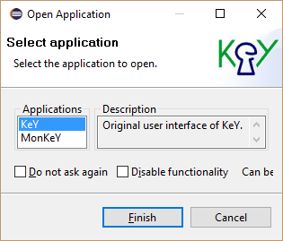
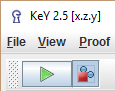

# KeY 4 Eclipse Starter

KeY 4 Eclipse Starter is a basic Eclipse extension to start KeY from
within Eclipse.

The following sections illustrate the main features of KeY 4 Eclipse
Starter using screenshots. Each section contains numbered screenshots
that explain a usage scenario step by step. Clicking on each picture
produces a more detailed view. The screenshots may differ from the
latest release.

## Prerequisites

KeY 4 Eclipse Starter is compatible with
[Eclipse](http://www.eclipse.org) Indigo (3.7) or newer.

Required update-sites and installation instructions are available in the
[download](../../download/index.html#eclipse) area.

## Open KeY

1. Open KeY via main menu item "KeY, Open Application".

    
    
2. Select Application "KeY".

    

3. Use KeY as normal.

    

## Verify a method contract

1. Select the method to verify.

    
    
2. Start proof via main menu item "KeY, Start Proof".

    
    
3. Select Application "KeY".

    

4. Instantiate proof in KeY as normal.

    

## Load a proof or key file

1. Select the proof or key file to load.

    

2. Start proof via main menu item "KeY, Load File".

    

3. Select Application "KeY".

    

4. Instantiate proof in KeY as normal.

    

## Stop auto mode when breakpoint is hit

1. Define a Line, Method or Java Exception breakpoint, a Watchpoint or
a KeY Watchpoint as usual.

    

2. Select toolbar item "Stop when a breakpoint is hit." before
starting the auto mode.

    

3. Auto mode stops when breakpoint is hit.

    

## KeY basics in Eclipse and troubleshooting

-   [KeY basics in Eclipse (Cross-project
    Functionality)](../CrossProject/index.html)
    -   [Create an example project](../CrossProject/index.html#example)
    -   [Change taclet options](../CrossProject/index.html#taclet)
    -   [Define class path used by
        KeY](../CrossProject/index.html#KeYsClassPath)
-   [Troubleshooting](../CrossProject/index.html#troubleshooting)
    -   [Unresolved classtype (support for API
        classes)](../CrossProject/index.html#API)
