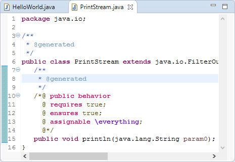

# Stubby - The Stub Generator

Stubby allows to generate stubs annotated with default JML
specifications for used API members.

The following sections illustrate the main features of Stubby using
screenshots. Each section contains numbered screenshots that explain
a usage scenario step by step. Clicking on each picture produces
a more detailed view. The screenshots may differ from the latest
release.

## Prerequisites

Stubby is compatible with [Eclipse](http://www.eclipse.org) Luna (4.4)
or newer.

Required update-sites and installation instructions are available in
the [download](../../download/index.html#eclipsePreview) area.

## Generate Stubs

1. Select "Generate Stubs" in the context menu of a Java project.

    

2. Define generation settings and finish the wizard.

    

3. Inspect the generated stub files.

    

## Edit Generated Stubs

1. Open the stub file to edit.

    

2. Replace `@generated` with `@generated NOT` to ensure that changes
will be maintained during stub generation. Modify specification
afterwards.

    
